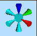

# Axis Controller

To show or hide the Axis Controller:

  * **3D View** ribbon **> > 3D Display >> Indicators >> Axis Controller**.

  * (In an external 3D window) **Format >> Indicators >> Axis Controller**.

The Axis Controller is used to set the view orthogonal to the X, Y or Z axis. When enabled, a controller appears in the top right of the target 3D window, like this:

**Note** : any 3D window can have an Axis Controller.

### Axes and View Directions

Each axis represent a different viewing direction. Three of these are coloured to indicate the current X, Y and Z axis orientation, using the same colour convention as is used in the [Axis Indicator](<Axis_Indicator.md>) where red is the X axis, green is the Y axis and blue is the Z axis.

### Changing the View Orientation

  * To change to a view orthogonal to the XY plane (top view), double-click or tap the blue Z axis.

  * To change to a view orthogonal to the YZ plane (view from the east, towards the west), double-click or tap the red X axis.

  * To select a view orthogonal to the XZ plane (view from south to the north), double click or tap the green Y axis.

  * To select the default view (top + rotated), double-click the centre of the controller.

Related topics and activities

  * [Axis Indicator](<Axis_Indicator.md>)

  * [View Controller](<view_controller.md>)

  * [Navigation heading and pitch scales](<VR_Navigation%20heading%20and%20pitch%20scales.md>)