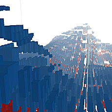
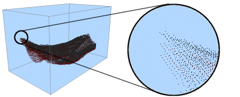
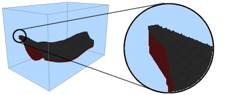
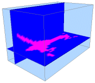
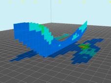

# Block Model 3D Display

A _model_ is a small-scale representation of a real situation. Models are usually designed and made to be manipulated or processed in such a way as to enhance the understanding of the situation the model represents.

_Block models_ represent three-dimensional shapes, volumes, tonnages and grades of solids such as ore zones, waste zones and other volumes of geological or mineralogical interest. Block models consist of blocks, which are cubes or cuboids, stacked together to fill the defined volume as closely as the block sizing criteria allows.

Block models are an integral data component of many Studio product workflows, including resource modelling, operation design and strategic design & planning. One or more block models can be displayed, or you can display the same model using multiple [overlays](<../COMMON/concept_views%20sheets%20overlays.md>).

Block models represent three-dimensional shapes, volumes, tonnages and grades of solids such as ore zones, waste zones and other volumes of geological or mineralogical interest. Block models consist of blocks, which are cubes or cuboids, stacked together to fill the defined volume as closely as the block sizing criteria will allow.

Block models are, in essence, a collection of cuboids representing a 3 dimensional unit (a cuboid)of an orebody or other structure. Each cuboid is supported by parameters that provide information about the ground data it represents; grade, rock type, blastability index, development zone and so on. The range of complexity between models is large, from a simple structural model denoting key mining zones up to a multiparametric model with hundreds of attributes accumulated throughout the exploration to operation mining cycle.

Regardless of what a model represents, it can be rendered using a variety of 3D display options. As with other 3D objects, it is the block model overlay that is displayed, and that over lay is supported by a [Block Model Properties: General](<BlockModels_Properties_Dialog.md>) console in which display parameters are set.

Block models can be rendered as blocks, lines, points or a data slice (intersection or quick section). They can be animated (say, to show an extraction sequence) and coloured using an array of options. They can be labelled, and as with all 3D objects, associated with external files, custom **[Information Mode](<vr_navigation_information.md>)** settings and [**3D display templates**](<../COMMON/3D_Window_Templates.md>).

A block model displayed in a 3D window, rendered as 'blocks'

## Block Model Display Options

Block models can be displayed as:

  * Pointsshow the current model as a series of points, with each point representing the volumetric centre of each block cell.

  * Linesview as a series of lines, each representing a major axis of a cuboid.

  * Blocksshow shaded model cuboids, or 'cells'. 

**Note** : this is the most processor-intensive display option.

  * Quick Section: show the model as a section along either the IJ, JK or IK planes (or, by loading the model more than once, several sections simultaneously). Note that this option will display full cells only, and does not rely on a previously defined section plane in memory.

  * Intersection: if selected, you can access one of the [previously defined VR sections](<workspace_sections.md>) in order to display a detailed cross-sectional view of your geological model, including sub-celling.

See [Block Model Slice Display](<Block%20Models_SectionvsIntersections.md>).

You can display your model as a single overlay, or as a collection of overlays, each with independent formatting parameters.

### Viewing Block Models as Points

It is also possible to view block model data as a cloud of points. These points, as will all viewing formats, are subject to coloring via an applied legend (or fixed color).

Point views of block model data can also be animated according to a sequencing field (see 'Block Model Sequencing Animations', below, for more information.

### Viewing Block Models as Strings

Another viewing option is to view your block model as a set of independent strings (lines). Viewing a block model as lines helps to portray more of the geometry of a block model data set with less effect on system resources.

Line views of block model data can also be animated according to a sequencing field (see 'Block Model Sequencing Animations', below, for more information.

### Viewing Block Models as Blocks (Cuboids)

You can also view your block model as cuboid blocks, with each block representing the total area of a block model cell. This is the most memory-intensive option, which may affect system performance adversely when viewing high-density block model data in conjunction with a restricted system hardware specification.

Each block model 'block' can be colored according to a legend key, as with all other block model view formats. Block views can also be animated according to a sequencing field (see 'Block Model Sequencing Animations', below, for more information.

### Viewing Block Models as a 'Quick Section'

Block model display options are set using an object-sensitive [Block Model Properties](<BlockModels_Properties_Dialog.md>) screen, accessed from the **Sheets** or **Project Data** control bar. Once data is imported, it is viewed by default as a single section through the data, for example:

Adjust the position and orientation of this section by right-clicking the block model object in the Sheets control bar and selecting the Quick Section Controls option (note that this option is only available when an object is currently viewed as a quick section). This displays the [Quick Section Contro](<SectionControl_Dialog.md>)l tool, which will allow you to reposition and reorient your section view.

This display option does not rely on a previously defined section plane in memory.

#### Viewing Multiple 'Quick Sections'

View multiple block model sections simultaneously by loading more than one instance of the same data set, and selecting theQuick Section Controls option for each. This allows you to control more than one section of the same block model independently:

You cannot view block model section data in conjunction with a sequencing animation.

See [Block Model Slice Display](<Block%20Models_SectionvsIntersections.md>).

### Viewing Block Models as an Intersection

Similar to sections, you can also view a slice of your block model in any direction using the Intersection option. This technique relies on a 3D section being defined beforehand, using the [Section](<workspace_sections.md>)area of theSheets or **Project Data** control bar.

See [3D Sections](<Sections.md>).

All available3Dsections are shown in theIntersection Section list of the[Block Model Properties](<BlockModels_Properties_Dialog.md>) screen. A slice through your model will then be shown, honouring any selected legend and color fields.

Note that, as with quick sections (see previous section), you can display multiple intersections by loading the same block model data twice, and setting up independent intersections for each model. Multiple intersections can then be shown in the same scene (as represented by the image above).

### Block Model Sequencing Animations

When viewed as blocks, points or strings, it is possible to apply a sequence animation. This animation can be configured and played back entirely from within your Studio 3 application. You can even record the results to an AVI or WMV video file using the standard simulation recording functions (see Related Topics for more information).

The [Block Model Properties](<BlockModels_Properties_Dialog.md>) screen lets you select any numeric field, held within the block model database, that can be used to define how the view of the model is built up on screen. For example, if you were to select the IJK field to represent the sequencing order, you could then use the Sequence Control tool (right-click the block model in the **Sheets** or **Project Data** control bar and select the Sequence Control option.

**Note** : the Sequence Control menu option is only available if a sequencing field has already been defined for the selected object.

The properties screen lets you set up the start and end points of the animation and control playback on screen. once an animation is configured, you can record the final screen activity to an external AVI or WMV file using the Simulation toolbar controls. See [Recording a Simulation](<simulation_recording.md>).

**Note** : you can't define more than one sequencing field for an overlay.

Related topics and activities

  * [Block Model Properties: General](<BlockModels_Properties_Dialog.md>)

  * [Block Model Slice Display](<Block%20Models_SectionvsIntersections.md>)

  * [Quick Section Controls](<SectionControl_Dialog.md>)

  * [Block Model Creation and Manipulation](<../STUDIO_RM/Block_Models_CreationAndManipulation.md>)

  * [Block Model Evaluation](<../STUDIO_RM/Block_Models_Evaluation.md>)

  * [Linking objects to other files](<Linking_files_to_other_objects.md>)