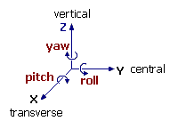

# Directional Light Source

A directional, coloured light source can be attached to any [3D simulation object](<Objects_Mobile%20objects.md>). This lets you add fixed and dynamic lighting to your 3D scene.

See [Add a VR Object Light](<Objects_Object%20lights.md>) for background information.

To add a directional light source:

  1. Display the **Sheets** control bar. This is typically found in your Home menu, although this differs between products.

  2. If you haven't done so already, add a simulation object to your 3D view. 

See [Placing Objects on Surfaces](<Objects_Placing_objects_on_surfaces.md>), [Mobile Simulation Objects](<Objects_Mobile%20objects.md>), [Place a Group of VR Objects](<Objects_Placing%20a%20group%20of%20objects.md>) and [Stationary VR Object types](<Objects_Stationary%20objects.md>).

  3. Right click the **VR Object Types** folder and select **New**.

The Object Type Properties screen displays.

  4. In the Lights field, double-click **< Add new light>**.

The Light Properties screen displays.

  5. In the Type box, choose a Directional light type. A Directional light source illuminates all object surfaces equally and is not affected by the position of the object the light source is attached to. The direction of the light is specified relative to the object axes, and hence, is affected by the orientation of the object in the world.

  6. Set the Color of the light.

**Tip** : if you're after very obvious lighting, set the colour to something that contrasts strongly with the colours used for other 3D objects in the 3D window.

  7. Define the **Orientation** of the light source by the Yaw (rotation about the Z or vertical axis), Pitch (rotation about the X or transverse axis) and Roll (rotation about the Y or central axis) angles relative to the object axes:  
  

Yaw |  Pitch |  Roll |  Direction  
---|---|---|---  
0 |  90 |  0 |  Points vertically down  
180 |  0 |  0 |  Points horizontally backwards  
90 |  0 |  0 |  Points horizontally sideways  
0 |  30 |  0 |  Points 30 degrees down to the front  
45 |  -45 |  45 |  Points diagonally up to the top right  

Related topics and activities

  * [Lighting](<Environment_Lighting.md>)

  * [Adding Lights to Objects](<Objects_Object%20lights.md>)

  * [Adding Object Types](<Object_Adding_an_object_type.md>)

  * [Placing Objects](<Objects_Placing_objects_on_surfaces.md>)

  * [Adding Fog](<Environment_Fog.md>)

  * [Simulating Sky Effects](<Environment_Sky.md>)

  * [Getting the right effect](<Environment_Getting%20the%20right%20effect.md>)