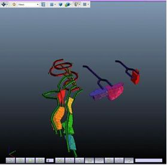

# Export to PDF3D

### To access this dialog:

  * Activate the 3D View ribbon and select Save to >> PDF3D

The Export to PDF3D screen is used to export loaded data in the 3D window to one of the following interactive 3D file formats, using the following PDF3D file types:

  * 3D PDF (*.pdf)
  * U3D (Universal 3D) (*.u3d)
  * PRC (Product Representation Compressed) (*.prc).

Interactive 3D formats provide the following advantages:

  * Improvements to the distribution, collaboration and sharing of Interactive spatial data, using a standard, high quality, compressible format. There is no need for specialized 3D visualization software - commonly-available PDF viewers can be used instead.

  * They can be embedded in Microsoft PowerPoint presentations, without the need for plug-ins, and included in technical reports.

You can export any visual data as a 3D PDF document: wireframes, strings, points, planes, block models and DirectX objects. You can also export 3D objects that can be embedded within a PDF document using a suitable PDF writer application.

An example of a PDF3D document showing embedded Datamine 3D files

Provided that the exported data format is supported for the file type that is requested, the formatting options you select for your data will be honoured: for example, wireframe data coloured with highlighted edges will be shown as such in the resulting PDF3D document, and if a block model is shown as a "quick intersection", that is how it will appear in the output file.

**Note** : If multiple views are shown in the data display (that is, you have split the window horizontally and/or vertically), only the active window is exported. You can activate a view by left-clicking inside it, which displays a yellow highlight around the edge.  

## File Format Characteristics and Usage

3D PDF

  * Viewing using PDF viewers.
  * Embedding in Microsoft Word and PowerPoint documents, and PDF documents.

U3D

  * Embedding in PDF documents.

  * Viewing using PDF viewers

  * Supports animations.

  * Can be edited using Adobe Acrobat 3D Toolkit.

PRC

  * More accurate surface definitions than U3D.

  * Stores curve and surface data with no loss of accuracy.

  * Supports both parametric and polygonal geometry.

  * Embedding in PDF documents.

  * Viewing using PDF viewers.

  * Retains geometry for reuse in CAD, CAM, and Datamine applications.

To export animated 3D data to a 3D PDF file:

  1. Load and format the required data in the 3D window.

  2. In the Sheets or **Project Data** control bar, 3D folder, right-click the item to be animated and select Properties.

**Tip** : alternatively, double-click the visible data in the 3D window.  

  3. On the Properties screen, General tab.

  4. If you plan to export an animated file, select the Sequence Column containing values to control the animation playback.

  5. If animating data, set Anim. Step to 1 or higher. Anim. Rateand Anim. Step can be used to configure the exported animation.  

  6. Ensure that data, animated or otherwise, is clearly visible in the primary 3D window. If exporting animated data, ensure the FINAL animation frame is displayed. See [Sequence Animations](<Sequencing.md>).

  7. Display the **Export to 3D PDF** screen.

  8. Enter or browse for a **Filename**. This the location and name of your output file. Use the browse button to pick a location.

  9. If a **Sequence Column** is defined (see above), **Animation** is available:

     * If **Animation** is **checked** , all available animation fields are exported to the output PDF file, allowing playback with a compatible PDF viewer application.

     * If Animation is **unchecked** , only the displayed animation frame is exported and animation options are not available in the PDF viewer.

  10. Decide if you wish to **Export hidden overlays** :

     * If **Export hidden overlays** is **checked** , all 3D overlay data is exported (and displayed) in the output document, regardless of the current visibility status in the primary 3D view.

     * If Export hidden overlays is **unchecked** , only visible overlay data is exported.

  11. Decide if you want to Export labels.

**Tip** : unchecking this option can improve performance of 3D view changes in the exported document.

  12. Choose if data compression is applied:

     * If **Compress output** is **checked** , exported data file size is reduced, although may take slightly longer to open.

     * If Compress output is **unchecked** , no file compression is performed.

  13. Click **OK** to export your file.

  14. Browse to the exported file, and view it in the PDF viewer.

When an animated/sequenced object has been included in the exported data, the 3D PDF file opens in Adobe Reader, with additional animation controls at the bottom of the screen, for example:

Related topics and activities

  * [Sequence Animations](<Sequencing.md>)

  * [Viewing Data](<../COMMON/Interface_Viewing%20Data.md>)

  * [3D Window Visualization](<VR_Introduction.md>)

  * [Windows, Sheets, Projections and Overlays](<../COMMON/concept_views%20sheets%20overlays.md>)

  * [The View Hierarchy](<../COMMON/View%20Hierarchy.md>)

  * [Sequence Control](<Sequence%20Control%20Dialog.md>)