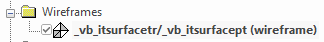
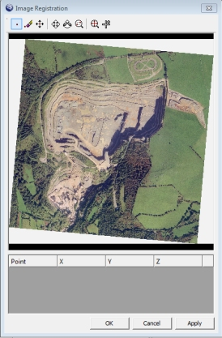
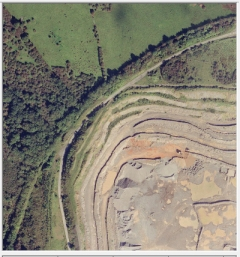
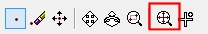
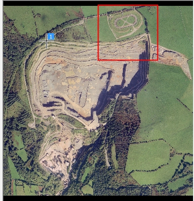
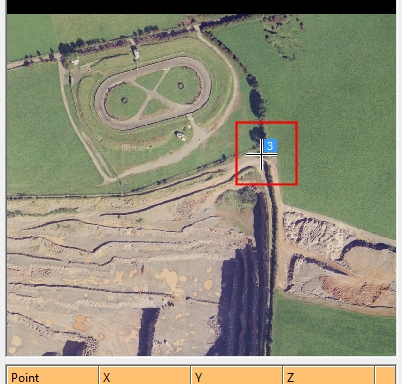
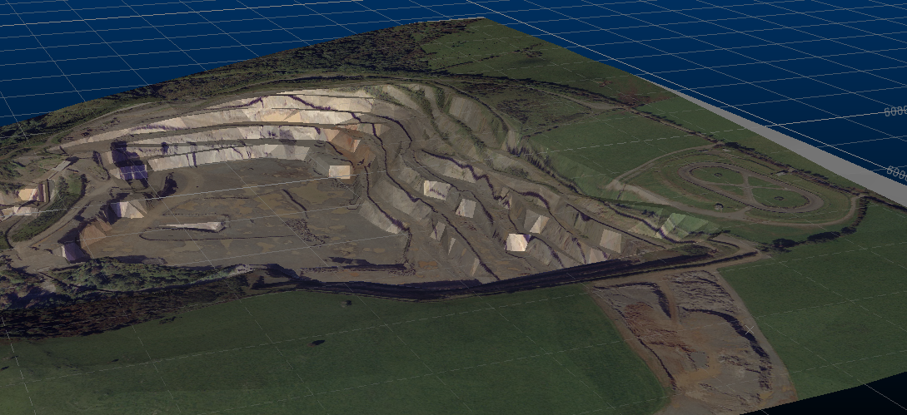

# Image Registration Example 2

Note: A Datamine [eLearning course](<https://datamine.learnupon.com/>) is available that covers functions described in this topic. Contact your local Datamine office for more details.

The example shows you how to align a texture on a loaded 3D wireframe surface using the [Image Registration](<ImageRegistration_Dialog.md>) screen.

You will load existing 3D topography data and use the **Image Registration** tool to align an image with known reference points (effectively, georeferencing the image). To ensure the points are applied to the same elevation, a section is created above the topography for alignment purposes.

## Sample Data

Sample data is already installed on your local system at the following location (assuming default settings were accepted during the install process):

  * C:\Database\DMTutorials\Data\VBOP

To align a texture image with a 3D topography: 

  1. Create a new project.

  2. In Windows Explorer, drag the following file from the **Sample Data** folder (see above) into the primary **3D** window:
     * \Datamine\_vb_itsurfacetr.dm

  3. **3D View** ribbon **> > View >> Zoom Fit >> Zoom Plan**.
  4. The aim is to display the open pit design in plan view, maximized to the screen, as shown:

;>)   

  5. Double-click any part of the displayed wireframe to display the **Wireframe Properties** screen.

  6. Select the ellipsis button on the right of the Texture field.

  7. Navigate to your Sample Data folder and open the following file:

     1. \Pics\_vb_ITPhoto-Texture_rotated.jpg

  8. Click OK and the texture is applied to the wireframe - note the incorrect alignment:

   

  9. In the **Project Data** control bar, expand the 3D folder until you can see your wireframe object default overlay, like this:

  10. Right-click the overlay and select Texture Drape Settings.

The Texture Drape Settings screen displays.

  11. Click **Use Points** (you are going to interactively line up image and surface points, not adjust the texture's rotation and position arbitrarily).

The Image Registration screen appears, showing a preview of your wireframe surface's assigned texture:

  12. Select the Zoom Area icon at the top of the screen:  
  

  13. Left-click to drag a rectangle similar to the area shown below:

;>)

  14. The view should now be similar to the following:

Your zooming does not have to be completely accurate, provided that most of the supply road is visible.

Tip: Use your mouse wheel to zoom the image preview in and out.  

  15. Click Add Point:

  16. Left-click the junction of the main supply road and pit access lane, as shown below. Get as close to the specified point as possible:

;>)

A reference point crosshair and "1" indicator then displays and a row is added to the georeferencing table below the image. You'll use this table later.  

  17. Use the Zoom Fit icon to maximize the texture to the screen as before:

  18. Next, magnify the area detailed below, using Zoom Area again:

;>)   

  19. Click Add Point again and left-click at the point shown below:  
  
;>)

  20. Zoom Fit again to maximize the texture image.  

  21. **Zoom Area** once more:

;>)

  22. Add a third and final georeferencing point here:

;>)

  23. The editable table at the bottom of the screen currently shows zero values for X, Y and Z for each point. This is the result of reference points being assigned to the image but not matched to a point in 3D space.
  24. In this example coordinates for these digitized points are known. The table shown below should be edited to show the figures provided:

Note: You can also pick coordinates in the 3D view, rather than entering them in. To do this, you can click New Point and digitize your texture image point as normal but them (immediately) click a point in the 3D window. You can snap to reference data (say, surveyed dig lines) to automatically add XYZ coordinates to the **Image Registration** table.

  25. In this case, you want to preserve the georeferenced information alongside the wireframe, meaning the texture is correctly oriented the next time the wireframe is loaded, so make sure Save georef. file is checked.
  26. Click OK to close the Image Registration screen.
  27. Click OK to close the Texture Drape Settings screen.

The textured wireframe should now be visible in plan view, with a texture that matches the shape of the topography underneath. Rotate the view and check how the pit rim lines up with the texture, for example:

;>)

  28. Save your project. When prompted, choose to save all files and automatically reload those listed. 

You can now reload your project to display your correctly georeferenced texture and wireframe.

Related topics and activities:

  * [Image Registration](<ImageRegistration_Dialog.md>)

  * [Image Registration - Example 1](<Image%20Registration%20Worked%20Example.md>)