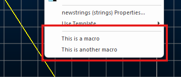

# Associating Files with 3D Objects

You can associate external files with loaded 3D objects via the [Associated Files](<Associated%20Files%20Dialog.md>) screen.

For example, you could associate summary information relating to survey station points, or add rimpull analysis data to a haultruck simulation object. 

External files are displayed using the current default application for the associated file type. You display a file by right-clicking the associated object overlay in any 3D window. For example, in the image below, two macro files are associated with a string. Right-clicking the string in a 3D view reveals the following options:

;>)

Clicking either opens the macro in a text editor (as that is the default viewer on the system for .mac files).

**Note** : the **Description** of an associated file is displayed in the menu. See below.

## What Files can be Linked?

The list below is not intended to be a definitive list of document types that can be linked to objects; it is an indication of the range of documents that are available - there are in fact very few documents which cannot be linked to 3D objects.

### Microsoft

  * Microsoft Office (any type)

  * Other Microsoft Office document types

  * Microsoft Works documents

  * Microsoft Windows script (SCT, WSF)

  * Automation script (JS, VBS)

### Datamine Products

  * InTouch (EVR)

  * Downhole Explorer (DHX)

  * Terrain (ETN)

  * ViewPoint (EVP)

  * OreFinder (EOF)

  * MaxiPit (ENS, GPH, MDL, GRD, SRF)

  * NPV Scheduler (ENS, GPH, MDL, GRD, SRF)

  * DHLogger

  * Borehole Manager

  * MineMapper

#### Studio Products

  * Datamine Studio 2 project (DMD) *

  * Datamine Studio 3 project (.dmproj) *

  * Datamine Studio RM project (.rmproj)

  * Datamine Studio EM project (.emproj)

  * Datamine Studio OP project (.opproj)

  * Datamine Studio Mapper project (.mapproj)

  * Datamine Studio NPVS project (.npvs)

  * Datamine Studio NPVS+ project (.snpvs)

  * Datamine Studio Geo project (.geoproj)

  * Datamine Studio UG project (.ugproj)

  * Datamine Strat3D project (.s3dproj)

  * Datamine Visualizer replay (GVP) *

## Database

  * Microsoft Access (MDB, ADP)

  * Text (TXT, CSV, RTF

  * WinZip archive (ARC, ZIP)

## CAD

  * AutoCad (DWG, DXF)

## Publishing

  * Crystal Reports (RPT)

  * Adobe Acrobat (PDF)

## Help

  * HTML Help (CHM)

  * Windows Help (HLP)

## Internet

  * Web pages (HTTP:)

  * Email addresses (URL:mailto)

  * FTP addresses (FTP:)

  * Microsoft Address Book (WAB, PAB)

  * Dial-Up Phonebook (PBK)

  * Dial-Up connection (RNK)

  * Microsoft Outlook (MSG)

  * Microsoft Internet Explorer (HTM, ASP, GIF, JPG)

  * Anti-Virus (SCAN)

## Multimedia

  * Pictures (BMP, JPG, GIF, TIF, PCX)

  * Audio (WAV, ASF, ASX)

  * Movies (MP3, AVI, MPEG)

Related topics and activities:

  * [Linking objects and files](<Linking_files_to_other_objects.md>)

  * [Associated Files](<Associated%20Files%20Dialog.md>)

  * [Setting Object Properties](<Object_Properties_Dialog.md>)