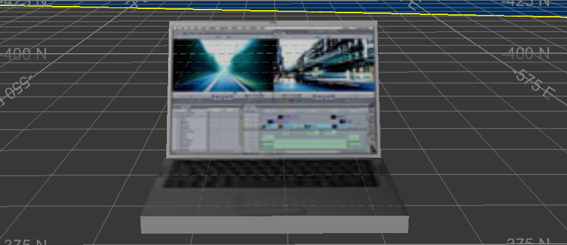

# VR Billboard Objects 

A billboard is a bitmap image that can be imported into the active 3D window and displayed as a [Stationary VR Object types](<Objects_Stationary%20objects.md>). 

They can be used to display text and a company logo etc.

To create a billboard:

  1. Display the **Sheets** control bar.

  2. Right click the VR Object Type menu and select **New**.

  3. Select the Model file to become the billboard.

**Note** : several DirectX objects are installed with your application. You can find them in your installation folder's **VR** sub-folder.

  4. Define the properties for your [VR Object Types](<Object_Adding_an_object_type.md>).

  5. Click **OK**.

A new VR Object appears in the **Sheets** control bar.

  6. Right-click the new VR object and select Place Object.

  7. Click in the 3D view to place the billboard object.

  8. Right-click the new object again and select **Outside View** to see the billboard. For example, here's a "Laptop.x" object in a 3D view:

;>)

To edit a billboard (or any) VR object model:

  1. Open the folder containing the model file 

  2. Open the model file (.x) in an ASCII text editor.

  3. Edit the file. Most of the file should be left alone, but you can locate the "TextureFilename" entry and change the bitmap file name to another in the same folder. Alternatively (and possibly a more visual approach) is to edit the associated .bmp file in the same folder.

  4. Place a new VR object. 

A useful option for billboards is Camera Aligned as this ensures the objects are always seen face on, and the correct way up. It can be controlled via the [Object Properties](<Object_Properties_Dialog.md>) screen