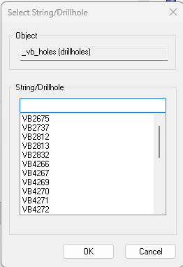

# Select String/Drillhole

To access this screen:

  1. Load or create and display string or drillhole data in any 3D window.

  2. In the **Sheets** or **Project Data** control bar, expand the **Strings** or **Drillholes** folder.

  3. Right click an overlay in the **Sheets** or **Project Data** control bar and select either **Look at Individual String** or **Look at Individual Drillhole**.

Centre and zoom the 3D window display to show a specific string or drillhole entity. 

Note: This differs from the Look at command in that this function allows you to pick any one of the associated data entities for the selected object. 

The screen displays the **Object** name followed by the indices of all string or drillhole entities in the selected object. 

  * For string data, an incremental numeric index is reported.

  * For drillholes, the BHID value is displayed.

For example, the following screen displays when opening the **Select String/Drillhole** screen for the loaded "DmTutorials" drillholes data "_vb_holes":

Type into the editable field to automatically filter the list. You can select one or more data entities.

Clicking **OK** adjusts the view to centralize and maximize the selected data in the target 3D window.

Related topics and activities:

  * [Look At Mode](<vr_navigation_look_at.md>)

  * [3D Strings Folder](<Sheets_strings.md>)

  * [3D Drillholes Folder](<Sheets_Drillholes.md>)