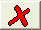

# Trace Properties (Attached Objects)

To access this screen:

  * Display the [Trace Properties](<Traces_Properties.md>) screen and select the **Attached Objects** tab.

Use this screen to view and adjust any VR objects currently attached to the selected string trace.

The Start Time shown represents the delay that is applied to an object before movement begins in a 3D simulation. 

Attach a new object to the string trace using the Object list. All VR objects of the current scene are listed.

 | Attach an object to the selected string, and append the existing list of attached objects.  
---|---  
 | Remove an attached object from the string, and add it to the **Object** list.  
 | Delete the selected object from the **Objects** list, and from the current project.  
  
Related topics and activities

  * [Trace Properties](<Traces_Properties.md>)

  * [Trace Properties (Vertices)](<Trace%20Properties%20Dialog%20\(Vertices\).md>)

  * [Attaching objects to strings](<Strings_Attaching%20objects%20to%20strings.md>)

  * [Creating a Flythrough](<Simulation_Creating%20a%20Flythrough.md>)

  * [Placing objects on surfaces](<Objects_Placing_objects_on_surfaces.md>)

  * [VR Objects](<sheets_vrobjects.md>)