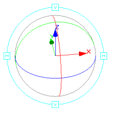
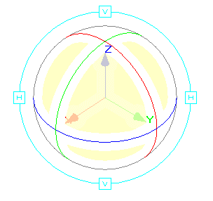
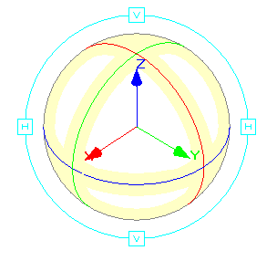

# The View Controller

To show or hide the 3D window view controller:

  * **3D View** ribbon **> > 3D Display >> Indicators >> View Controller**.

The View Controller is an interactive tool used to rotate the view in either a 'free form' mode, or around a fixed horizontal or vertical axis.

Once displayed, you can rotate the view around the center point of the controller's 'sphere' (which will always be the centre of the display window).

There are several operating modes for using the View Controller; you can opt to rotate the scene but maintain a fixed alignment with a nominated view axis (X, Y or Z), rotate the view around the centre point in any direction (no axis restrictions), or you can opt to rotate around a proprietary vertical or horizontal screen axis. It can also be used as a non-interactive axis indicator.

## Using the View Controller

The View Controller operates on a click-and-drag basis, and will only affect the view if the initial mouse click is within the confines of the controller's sphere. If the mouse is not clicked within this boundary, whichever general view modes have been set previously (look at mode, floating view etc.) become active, and the controller display will update dynamically according to whichever view changes are made.

  * To rotate the view around the centre point of the controller's sphere, without restriction: click-and-drag, starting within any of the sphere's 'free rotate' zones (highlighted yellow in the image below) i.e. a position that is not touching (or close to ) any of the axis indicator XYZ 'arrows' or the associated sphere circumference lines.  
  

  * To rotate around either the X, Y or Z axis: click-and-drag, starting in close proximity to any of the X, Y or Z sphere circumference indicator zones (highlighted in yellow in the image below). After clicking on (or close to) one of the circumference indicators, the associated cursor drag movement will rotate the view relative to the selected circumference indicator.  
  

  * To rotate around an horizontal/vertical axis: click-and-drag one of the 'H' or 'V' boxes, in orbit around the sphere, to rotate the view around an horizontal or vertical axis respectively.

  * To rotate the scene in a plane orthogonal to the viewplane : click-and-drag the outer light blue ring (but not on or near to the 'H' or 'V' boxes).

Related topics and activities

  * [Axis Controller](<axes%20control%20tool%20overview.md>)

  * [Axis Indicator](<Axis_Indicator.md>)