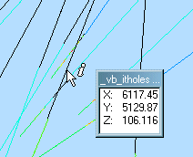

# Information Mode

To activate this mode:

  * **Home** ribbon **> > Query >> Dynamic**.

Display data column values associated with the selected points on a 3D object displayed in the 3D window.

Data is displayed when left clicking (or tapping the stylus onto) 3D data and holding. Attributes and values are displayed as defined on the **[Info Mode List](<Traces%20Properties%20Dialog%20\(Info%20Mode%20List\).md>)** screen. By default all data object attributes and values are displayed, but this can be constrained.

Holding the mouse button or stylus down and dragging whilst in Information Mode dynamically updates the data popup. This can be useful, for example, if tracking coordinate changes across a surface or survey string. 

**Note** : Information Mode is also referred to as "Dynamic Information Mode" throughout this help system, and other Datamine literature.

All visual data types can be interrogated in Information Mode.

**Note** : to exit Information Mode, either press ESC or click the right mouse button (or a dynamic stylus equivalent action). Launching any interactive design command (such as new-string, for example) will automatically dismiss Information Mode.

Active Information Mode for a string with a custom attributes list

Related topics and activities

  * [Info Mode List](<Traces%20Properties%20Dialog%20\(Info%20Mode%20List\).md>)

  * [Associated Files](<Associated%20Files%20Dialog.md>)

  * [Selecting 3D Data Interactively](<../COMMON/Selecting3DDataInteractively.md>)

  * [Attributes](<../COMMON/Attributes.md>)