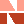

#  Command and Processes Table - P  
  
These tables list all commands and processes available in all Datamine Studio products. If your product has access to a command or process, the link on the left of the table displays a help file. If no link appears, the function isn't available in your product.

Symbols used in this table:

 A green tick indicates that the module is part of the core system licensing for the specified product - no additional module is required.

X A red cross indicates the module is not part of the listed system and any commands held within it cannot be run (a separate product will be required).

� A blue diamond indicates the module is an optional extra for the specified system and will require a dedicated, additional license.

**Note** : For an explanation of the terms 'command', 'process' and 'macro command', see [Command Table Introduction](<commandtable.md>).

For Macro commands, see [here](<commandtable.md>).

## Commands - P

Command Name  |   |   |   |   |   |   |   |   |   |  Description |  More Help  
---|---|---|---|---|---|---|---|---|---|---|---  
`pan-down-graphics` |   |   |   |   |   |   |   |   |   |  Move the view upwards. | [Command Help](<pan-down-graphics.md>)  
`pan-graphics` |   |   |   |   |   |   |   |   |   |  Move the view, staying in the current view plane. | [Command Help](<pan-graphics.md>)  
`pan-left-graphics` |   |   |   |   |   |   |   |   |   |  Move the view towards the right. | [Command Help](<pan-left-graphics.md>)  
`pan-right-graphics` |   |   |   |   |   |   |   |   |   |  Move the view towards the left. | [Command Help](<pan-right-graphics.md>)  
`pan-up-graphics` |   |   |   |   |   |   |   |   |   |  Move the view downwards. | [Command Help](<pan-up-graphics.md>)  
`paste-ring` |  X |  X |  X |  X |  X |   |  X |  X |  X |  Paste previously copied ring data from the clipboard. | Command Help  
`perimeter-selection-switch` |   |   |   |   |   |   |   |   |   |  Toggle to control how boundary (closed) strings are selected in relation to the mouse-click position. | [Command Help](<perimeter-selection-switch.md>)  
`pick-inner-limit` |   |   |   |   |   |   |   |  X |  X |  Select a string that is to define an inner limit (hole) of the DTM. | [Command Help](<pick-inner-limit.md>)  
`pick-outer-limit` |   |   |   |   |   |   |   |  X |  X |  Select a string that is to define an outer limit of the DTM. | [Command Help](<pick-outer-limit.md>)  
`pit-contours` |  X |  X |   |   |  X |  X |  X |  X |  X |  Generate contours from a wireframe surface. Displays the Shell Contours task panel. | Command Help  
`plan-drillholes` |   |   |  X |  X |   |  X |  X |  X |  X |  Edit or create a drillhole layout. | [Command Help](<plane-by-one-point.md>)  
`plane-by-one-point` |   |   |   |   |   |   |   |   |   |  Set view plane location and orientation (3D window) based on a selected point and orientation. | [Command Help](<plane-by-one-point.md>)  
`plane-by-three-points` |   |   |   |   |   |   |   |   |   |  Set the current section (3D window) position and orientation based on three selected points. | [Command Help](<plane-by-three-points.md>)  
`plane-by-two-points` |   |   |   |   |   |   |   |   |   |  Set the current section (3D window) position and orientation based on two selected points. | [Command Help](<plane-by-two-points.md>)  
`plane-display-change` |   |   |   |   |   |   |   |   |   |  Show/Hide planes objects data. | [Command Help](<plane-display-change.md>)  
`plane-display-hide` |   |   |   |   |   |   |   |   |   |  Hide all planes objects data. | [Command Help](<plane-display-hide.md>)  
`plane-display-show` |   |   |   |   |   |   |   |   |   |  Display all planes objects data. | [Command Help](<plane-display-show.md>)  
`point-display-change` |   |   |   |   |   |   |   |   |   |  Show/Hide all points objects data. | [Command Help](<point-display-change.md>)  
`point-display-hide` |   |   |   |   |   |   |   |   |   |  Hide all points objects data. | [Command Help](<point-display-hide.md>)  
`point-display-show` |   |   |   |   |   |   |   |   |   |  Show all points objects data. | [Command Help](<point-display-show.md>)  
`polygon-intersection` |   |   |   |   |   |   |   |   |   |  For selected polygons in the 3D window, this command creates a new polygon which contains the area common to all of them. | [Command Help](<polygon-intersection.md>)  
`polygon-intersection-delete-originals` |   |   |   |   |   |   |   |   |   |  For selected polygons in the 3D window, this command creates a new polygon which contains the area common to all of them, and deletes the original strings used to create the overlap. | [Command Help](<polygon-intersection-delete-originals.md>)  
`polygon-union` |   |   |   |   |   |   |   |   |   |  If overlapping polygons are selected in the 3D window, this command creates a new polygon which contains the area inside all of them. | [Command Help](<polygon-union.md>)  
`polygon-union-delete-originals` |   |   |   |   |   |   |   |   |   |  If overlapping polygons are selected in the 3D window, this command creates a new polygon which contains the area inside all of them, and deletes the original data. | [Command Help](<polygon-union-delete-originals.md>)  
`presplit-layout` |  X |  X |   |   |  X |  X |  X |  X |  X |  This command lays out a blast pattern presplit line using a blast patterns file. |   
`prev-ring-plane` |  X |  X |  X |  X |  X |   |  X |  X |  X |  Set the view to the next or previous ring plane along survey string. |   
`progress-monitor-switch` |   |   |   |   |   |   |   |   |   |  Toggles the use of the progress monitor when running commands. | [Command Help](<progress-monitor-switch.md>)  
`project-points-to-wf` |   |   |   |   |   |   |   |   |   |  Project the selected point(s) vertically onto the uppermost surface of the current wireframe object. | [Command Help](<project-points-to-wf.md>)  
`project-points-to-wf-angle` |   |   |   |   |   |   |   |   |   |  Project points onto a wireframe at the angle determined by the **SDIP** and **DIPDIRN** fields associated with the current points object if present. | [Command Help](<project-points-to-wf-angle.md>)  
`project-points-to-wf-in-view` |   |   |   |   |   |   |   |   |   |  Project selected points onto a wireframe surface that is lying directly behind the selected points, along the line of sight. | [Command Help](<project-points-to-wf-in-view.md>)  
`project-points-to-wfs` |   |   |   |   |   |   |   |   |   |  Project a point or points onto a wireframe surface directly downwards, regardless of whether the wireframe is in current view or not. | [Command Help](<project-points-to-wfs.md>)  
`project-string-at-angle` |   |   |   |   |   |   |   |   |   |  Project string according to angle defined by rosette or model slope. | [Command Help](<project-string-at-angle.md>)  
`project-string-onto-wf` |   |   |   |   |   |   |   |   |   |  Project a string vertically to intersect with a wireframe surface. | [Command Help](<project-string-onto-wf.md>)  
`project-string-onto-wf-in-view` |   |   |   |   |   |   |   |   |   |  Project a string along the line of view onto a visible wireframe surface. | [Command Help](<project-string-onto-wf-in-view.md>)  
`project-string-onto-wf-limit` |   |   |   |   |   |   |   |   |   |  Enables a string to be projected onto a wireframe using minimum and maximum distances to control up and down projections. | [Command Help](<project-string-onto-wf-limit.md>)  
`project-string-onto-wfs` |   |   |   |   |   |   |   |   |   |  Project string(s) to intersect wireframe surface(s). | [Command Help](<project-string-onto-wfs.md>)  
`project-to-view-plane` |   |   |   |   |   |   |   |   |   |  Project a string onto the current view plane. | [Command Help](<project-to-view-plane.md>)  
  
## Processes - P

Process Name  |   |   |   |   |   |   |   |   |   |  Description |  More Help  
---|---|---|---|---|---|---|---|---|---|---|---  
`PANELEST` |   |   |   |   |  X |   |   |  X |  X |  Estimate grade and variance of 2D or 3D panels. |  [Process Help](<../Process_Help_XML/panelest.md>)  
`PANELK` |   |   |   |   |  X |   |  X |  X |  X |  This process estimates the average value and the estimation variance of irregular shaped 2-D panels using kriging. |  [Process Help](<../Process_Help_XML/panelk.md>)  
`PCA` |   |   |  X |  X |   |  X |  X |  X |  X |  Principal Components Analysis groups fields together into components on the basis of the correlation (R) or variance/covariance (C) matrix. |  [Process Help](<../Process_Help_XML/panelk.md>)  
`PDRIVE` |   |   |   |   |   |   |   |   |   |  Sends a plot file to the plotter. |  [Process Help](<../Process_Help_XML/pdrive.md>)  
`PERDTM` |   |   |   |   |   |   |   |   |  X |  Converts 2-dimensional perimeters to 3-dimensional perimeters by vertical projection onto a DTM surface. |  [Process Help](<../Process_Help_XML/perdtm.md>)  
`PERFIL` |   |   |   |   |   |   |   |   |  X |  This process creates a set of block model cells and subcells which are bounded in 2 dimensions by a perimeter, and in the third dimension by perpendicular projection distances **DPLUS** and **DMINUS**. |  [Process Help](<../Process_Help_XML/perfil.md>)  
`PEROPN` |   |   |   |   |   |   |   |   |   |  This process will open or close all perimeters in the input file. |  [Process Help](<../Process_Help_XML/peropn.md>)  
`PERTAG` |   |   |   |   |   |   |   |   |   |  Updates the TAGs in a perimeter and a TAG file.  |  [Process Help](<../Process_Help_XML/pertag.md>)  
`PERTRA` |   |   |   |   |   |   |   |   |   |  Generates perimeters in planes across other perimeters. |  [Process Help](<../Process_Help_XML/pertra.md>)  
`PICDIR` |   |   |   |   |   |   |   |   |   |  Writes file names to an output file (catalogue file) if the file name or field names within the file match the given pattern expressions. |  [Process Help](<../Process_Help_XML/picdir.md>)  
`PICFLD` |   |   |   |   |   |   |   |   |   |  Writes field names to an output file if the field names in the input file match the given pattern expressions. |  [Process Help](<../Process_Help_XML/picfld.md>)  
`PICREC` |   |   |   |   |   |   |   |   |   |  Writes records to an output file if the records in the input file match the given input expressions. |  [Process Help](<../Process_Help_XML/picrec.md>)  
`PICTED` |   |   |   |   |   |   |   |   |   |  Interactive display and manipulation of Datamine plot files to produce composite plots. |  [Process Help](<../Process_Help_XML/picted.md>)  
`PITMOD` |   |   |   |   |   |   |  X |   |  X |  Creates an in-pit model and allows a quick evaluation of an overall pit design. |  [Process Help](<../Process_Help_XML/pitmod.md>)  
`PITRES` |   |   |  X |  X |  X |  X |  X |  X |  X |  Enhanced reserve tabulation of a RESULTS file. |  [Process Help](<../Process_Help_XML/pitres.md>)  
`PLOTAN` |   |   |   |   |   |   |   |   |   |  Generates a scatter plot file, where each data point is annotated with the value of a given field. |  [Process Help](<../Process_Help_XML/plotan.md>)  
`PLOTAR` |   |   |   |   |   |   |   |   |   |  Generates a scatter plot file, where each data point is annotated with an arrow symbol plotted relative to the X,Y data point. |  [Process Help](<../Process_Help_XML/plotar.md>)  
`PLOTCN` |   |   |   |   |   |   |   |   |   |  Spline contouring in plan or orthogonal sections for point, wireframe or block model data. |  [Process Help](<../Process_Help_XML/plotcx.md>)  
`PLOTCX` |   |   |   |   |   |   |   |   |   |  Spline contouring in plan, orthogonal sections or a rotated section plane with point, wireframe or block model data. |  [Process Help](<../Process_Help_XML/plotcx.md>)  
`PLOTDA` |   |   |   |   |   |   |   |   |   |  Generates a scatter plot file, where each data point is annotated with a symbol centered on the point. |  [Process Help](<../Process_Help_XML/plotda.md>)  
`PLOTFR` |   |   |   |   |   |   |   |   |   |  Generates a frame plot, consisting of a frame, a grid or tick marks, with annotation on each axis, and user defined titles on each axis. |  [Process Help](<../Process_Help_XML/plotfr.md>)  
`PLOTFT` |   |   |   |   |   |   |   |   |   |  Generates a frame plot, with linear, log and probability options for each axis. |  [Process Help](<../Process_Help_XML/plotft.md>)  
`PLOTFX` |   |   |   |   |   |   |   |   |   |  Generates a frame plot consisting of a frame, annotated grid, title block and legend block. |  [Process Help](<../Process_Help_XML/plotfx.md>)  
`PLOTGR` |   |   |   |   |   |   |   |   |   |  Generates a plotted grid, or set of lines, at any user-defined angle to the plot X and Y axes. |  [Process Help](<../Process_Help_XML/plotgr.md>)  
`PLOTHI` |   |   |   |   |   |   |   |   |   |  Generates a bar chart or histogram plot file. |  [Process Help](<../Process_Help_XML/plothi.md>)  
`PLOTLI` |   |   |   |   |   |   |   |   |   |  Generates a line plot file. |  [Process Help](<../Process_Help_XML/plotli.md>)  
`PLOTLN` |   |   |   |   |   |   |   |   |   |  Generates a line plot file from line segments. |  [Process Help](<../Process_Help_XML/plotln.md>)  
`PLOTMX` |   |   |   |   |   |   |   |   |  X |  Plots the intersection of a block model with any plane. |  [Process Help](<../Process_Help_XML/plotmx.md>)  
`PLOTPA` |   |   |   |   |   |   |   |   |   |  Plot all perimeters in a standard perimeter file. |  [Process Help](<../Process_Help_XML/plotpa.md>)  
`PLOTPE` |   |   |   |   |   |   |   |   |   |  Generates a plot file of perimeters. |  [Process Help](<../Process_Help_XML/plotpe.md>)  
`PLOTPI` |   |   |   |   |   |   |   |   |   |  Process to plot multiple numeric data variables as colored sectors with the radii proportional to the respective variable value. |  [Process Help](<../Process_Help_XML/plotpi.md>)  
`PLOTPX` |   |   |  X |  X |  X |  X |  X |  X |  X |  Enhanced perimeter plotting. |  [Process Help](<../Process_Help_XML/plotpx.md>)  
`PLOTSI` |   |   |   |   |   |   |   |   |   |  Scatter plot of data with optional annotation of the selected data fields and plotting of symbols and icons. |  [Process Help](<../Process_Help_XML/plotsi.md>)  
`PLOTSK` |   |   |   |   |   |   |   |   |   |  Kidd Creek annotated section plot through drillholes. |  [Process Help](<../Process_Help_XML/plotsk.md>)  
`PLOTSX` |   |   |   |   |   |   |   |   |   |  Enhanced plotting of drill hole sections and level plans. Used in conjunction with `PLOTFX`, `PLOTSX` will produce high quality section plots. |  [Process Help](<../Process_Help_XML/plotsx.md>)  
`PLOTTI` |   |   |   |   |   |   |   |   |   |  Generates a plot file containing a plot title. |  [Process Help](<../Process_Help_XML/plotti.md>)  
`PLOTTR` |   |   |   |   |   |   |   |   |  X |  Generates a plan projection of the linkages in a wireframe model. |  [Process Help](<../Process_Help_XML/plottr.md>)  
`PLOTTX` |   |   |   |   |   |   |   |   |   |  Generates a plot from a text file. |  [Process Help](<../Process_Help_XML/plottx.md>)  
`PLOTVA` |   |   |   |   |   |   |   |   |   |  Generates a multi-value scatter plot file, where each data point is annotated by up to 10 fields centered on this point. |  [Process Help](<../Process_Help_XML/plotva.md>)  
`PLOTWS` |   |   |   |   |   |   |   |   |  X |  Section plot in any direction through a wireframe model. |  [Process Help](<../Process_Help_XML/plotws.md>)  
`PLTABL` |   |   |   |   |   |   |   |   |   |  Generates a tabulated report on the plotter. |  [Process Help](<../Process_Help_XML/pltabl.md>)  
`PLTLAY` |   |   |   |   |   |   |   |   |   |  Interactive graphics plot editing and layout process. |  [Process Help](<../Process_Help_XML/pltlay.md>)  
`POLREG` |   |   |   |   |   |   |   |   |   |  Polynomial regression. The polynomial fitted is up to the 5th order, and thus includes a regression line. |  [Process Help](<../Process_Help_XML/polreg.md>)  
`POLYDC` |   |   |   |   |   |   |  X |   |  X |  The `POLYDC` process calculates a set of declustered weights for a set of sample data using the polyhedra method. |  [Process Help](<../Process_Help_XML/polreg.md>)  
`PPQQPLOT` |   |   |   |   |   |   |  X |   |  X |  Polynomial regression. The polynomial fitted is up to the 5th order, and thus includes a regression line. |  [Process Help](<../Process_Help_XML/polreg.md>)  
`PROMOD` |   |   |   |   |   |   |   |   |  X |  The `PROMOD` process "optimizes" a block model so that the minimum number of subcells is used, without losing accuracy. |  [Process Help](<../Process_Help_XML/promod.md>)  
`PROPER` |   |   |   |   |   |   |   |   |   |  This process copies and conditions a set of perimeters. |  [Process Help](<../Process_Help_XML/proper.md>)  
`PROTOM` |   |   |   |   |   |   |   |   |  X |  Generates a prototype block model, consisting of a Data Definition with standard field names and user-supplied default values. |  [Process Help](<../Process_Help_XML/protom.md>)  
`PROTOP` |   |   |   |   |   |   |   |   |   |  Creates a prototype plot file with defined plot and data area shape/size, and optionally data ranges and scaling factors. |  [Process Help](<../Process_Help_XML/protop.md>)  
`PTCLD2WF` |   |   |   |   |  X |   |   |   |  X |  Reconstruct a 3D surface from an input point cloud object |  [Process Help](<../Process_Help_XML/ptcld2wf.md>)