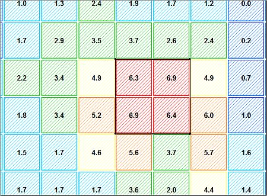
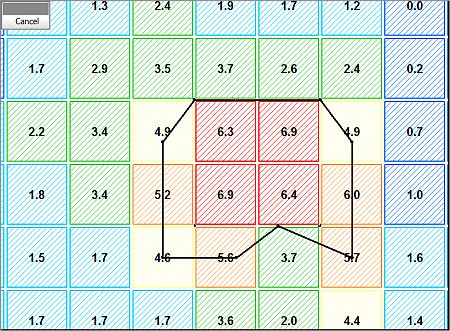
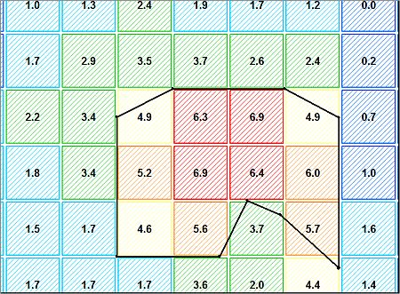

# adjust-string-in-ore ("adj")

See this command in the [**command table**.](<_COMMAND%20TABLE_A.md#adjust-string-in-ore>)

To access this command:

  * Model ribbon **> >** Manipulate >> Adjust to Ore

  * Using the **[command line](<../COMMON/Command_Toolbar.md>)** , enter `adjust-string-in-ore`.

  * Use the quick key combination "adj".

  * Display the **[Find Command](<../COMMON/findcommand.md>)** screen, locate _adjust-string-in-ore_ and click **Run**.

## Command Overview

Adjust an ore outline (string) using a grade cut-off or legend categories for the displayed ore block model.

The string used to define the ore outline can be either open or closed. A block model file must already be loaded. Adjustment is performed laterally in the plane of the string. If the string is not planar an approximate plane is used in which to perform the adjustment. 

The amount of adjustment is set using [set-step-distance](<set-step-distance.md>). The step distance can be positive to expand the string or negative to shrink the string. The default step distance is based upon the minimum cell dimension of the block model. The adjustment is done by moving each string point by the defined step distance and checking to see if it falls within ore or waste.

Use [set-adjustment-method-switch](<set-adjustment-method-switch.md>) to select the adjustment method to either _cut-off grade_ or _legend items_.

#### Example 1: Using a cut-off grade

In the following example, the block model is coloured on CU, using a legend with interval values of '1'; the cells are 10x10x10m in size. The black coloured ore outline initially encloses cells with values of CU>6.0. Using a step distance of 5m and a cut-off grade of CU=4, the following three adjustment steps have been made:

**Note** : Additional adjustment steps are still possible as not all block model cells that fall above the cut-off have been reached yet, using the defined step size. Using an outline with additional string vertices and using a different step size will yields slightly different results. 

This is the unadjusted outline:

This is the outline after one adjustments step:

After two adjustment steps:  

To adjust an ore string using a cut-off grade

  1. Select a 3D window.

  2. Create, or load and display a grade model and ore outline strings..

  3. Colour the block model using the target grade field (for clarity).

  4. Use [set-adjustment-method-switch](<set-adjustment-method-switch.md>) ("am") to toggle to the CUT OFF grade method (the selected method will appear in the status bar when toggling).

  5. Set the cut-off grade field and value using [set-adjustment-cut-off](<set-adjustment-cut-off.md>) ("scu"). Click Cancel.

  6. Set the adjustment step distance using [set-step-distance](<set-step-distance.md>) ("ssd"). Click Cancel.

  7. Select the required string in a **3D** window.

  8. Run adjust-string-in-ore ("adj"). Repeat for multiple adjustments. Click Cancel.

  
To adjust an ore string using a cut-off grade:

  1. Select a 3D window.

  2. Create, or load and display a grade model and ore outline strings..

  3. Create or load an evaluation legend, that is, a legend that defines different ore categories. 

  4. In [Project Settings](<../COMMON/Project%20Settings_Mine%20Design.md>), pick appropriate **Evaluation Control** options.

  5. Set the block model colouring to show the grade field using the evaluation legend.

  6. Select the LEGEND ITEMS method using [set-adjustment-method-switch](<set-adjustment-method-switch.md>) ("am"). click Cancel.

  7. Set the cut-off grade field and value using [set-adjustment-cut-off](<set-adjustment-cut-off.md>) ("scu"). Click Cancel.

  8. Set the adjustment step distance using [set-step-distance](<set-step-distance.md>) ("ssd"). Click Cancel.

  9. Activate the **Home** ribbon and selectSelect >> Deselect >> Deselect All Strings.

  10. Define ore and waste categories using [set-ore-categories](<set-ore-categories.md>).

  11. Run adjust-string-in-ore ("adj"). Repeat for multiple adjustments. Click Cancel.

  12. In the pop up dialog, select **Yes** for ore, Select **No** for non-ore for each displayed legend item (a prompt is shown for each category in the evaluation legend).

  13. Confirm your selections.

  14. Select the string(s) to be adjusted.

  15. Check the adjusted outline(s) against the displayed model cells.

**Note** : undo previous adjustments with <CTRL> \+ <Z> or running [undo-last-string-edit](<undo-last-string-edit.md>).

Related topics and activities

  * [set-adjustment-method-switch](<set-adjustment-method-switch.md>)

  * [set-adjustment-cut-off](<set-adjustment-cut-off.md>)

  * [set-ore-categories ("soc")](<set-ore-categories.md>)

  * [set-step-distance](<set-step-distance.md>)

  * [set-ore-categories](<set-ore-categories.md>)