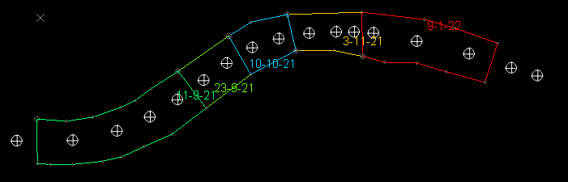

# attributes-from-perimeters ("afp")

See this command in the [**command table**.](<_COMMAND%20TABLE_A.md#attributes-from-perimeters>)

To access this command:

  * **Data** ribbon **> > Attributes >> From Perimeters**.

  * **Digitize** ribbon **> > Attributes >> From Perimeters**.

  * Using the **[command line](<../COMMON/Command_Toolbar.md>)** , enter "attributes-from-perimeters"

  * Use the quick key combination "afp".
  * On the **[Find Command](<../COMMON/findcommand.md>)** screen, highlight **attributes-from-perimeters** and click **Run**.

## Command Overview

Copy attributes and values from closed perimeter strings to enclosed target data. Target data can be one of the following types, which must be loaded:

  * Points

  * Strings

  * Drillholes

  * Wireframes

One or more perimeters (from the same or different loaded string objects) can be used to attribute contained data. One or more attributes and values can be copied simultaneously. 

Perimeters can overlap, but if target data exists in the overlapping area, assignment of attributes and values is based on the creation order of the perimeter strings, which can be tricky to predict.

Only non-system and non-virtual attributes can be copied from a perimeter to the target data. It is not possible, for example, to copy coordinate field values to target data. Similarly, virtual attributes such as _LENGTH can't be copied as these attributes contain dynamic, transient numeric values that will not be relevant for the data to be attributed.

Consider the following example: a series of activity points falls within segments of imported drive wall data. The wall data contains a reference to the blasting date (**BLASDATE**), which would a useful addition to the points database:  
  

Using the **attributes-from-perimeters** command, applying the **BLASDATE** attributes to the underlying points is as simple as selecting the input perimeters object, the output points object and the projection direction of the perimeters (see "Perimeter Projection", below) and applying an update, resulting in:

## Perimeter Projection

Data is attributed if it falls within the confines of a perimeter projected in a specified direction. You can specify the projection plane using the **Plane Orientation** options, including the current line of view in the active **3D** window. 

The projection direction is set independently of the current view plane (unless you choose to use the view direction) or the best fit plane through the perimeter data (or target data). As such, perimeters can be digitized in any orientation, and projected to include or exclude data using any 3D plane.

## Perimeter Attribution Guidelines

  * Perimeters must be closed strings. Open strings can't be used to attribute other data.

  * Ideally, perimeters should be distinct, and if they do overlap, no target data should occur in the overlap region(s). This is because the resulting attribute and value on the target data is difficult to predict.

  * Perimeters can exist in one or more objects. If an object is picked, all perimeters within that object are used to attribute data (open strings are ignored).

  * To use perimeters from more than one object, select them in any 3D view and choose to **Store Current Selection**.

  * All custom attributes from all selected perimeters are listed. You can choose to transfer any or all of them to the target data.

  * Selected custom attributes of perimeter data are transferred to the target object. Data that falls outside any attributed perimeters will receive an absent data indicator.

  * Only user attributes and values can be transferred from a perimeter. System and virtual attribute data cannot be transferred.

  * You can update existing target data attributes; if new data values are transferred, they replace the old ones.

  * Target data can be only partly enclosed in a perimeter:

    * If attributing string or drillhole data, it will receive the intended perimeter attribute value(s) if more than 50% of the string or drillhole length is enclosed within a perimeter. 

    * If attributing points wireframe data, it will receive the intended perimeter attribute value(s) if more than 50% of the area of a wireframe triangle falls within the perimeter.
    * If any data is coincident with the edge of a perimeter, it is considered to be within the perimeter.

To copy attribute values from perimeter data to a target data object:

  1. Load the perimeter data containing custom attribute values to transfer to other data.

  2. Load the target points, strings, drillholes or wireframe data to receive the new attribute values.

  3. Run the **attributes-from-perimeters** command.

  4. Choose your perimeter data:

     * If perimeter data is stored in a single loaded data **Object** , choose it.

     * If perimeter data is stored in multiple objects, or you only want a single perimeter of a multi-perimeter loaded object to be used for attribution, select the perimeter data in any 3D window and choose **Store Current Selection** (and its corresponding option button).

  5. In the **Attributes to Copy** table enable the attribute(s) value(s) you wish to transfer to the target data. Only selected attribute values are transferred.

  6. Choose the **Plane Orientation** along which perimeter data is projected to include (or exclude) and assign attributes values (or an absent data indicator). Data that falls within the imaginary volume created by extruding the perimeter data orthogonal to the selected plane (in both directions) is attributed according to the perimeter attribute value(s).

     * Pick a preset plane orientation such as **Horizontal** , **North-South** or **East-West** , or;

     * Choose **From Perimeter** to project along a plane orthogonal to the mean (best-fit) plane of the perimeter strings. All used perimeters are considered here, so if perimeter orientations vary within the set, an average plane is used. Alternatively;

     * Choose **View Plane** to project perimeter data along the current 'line of sight' of the primary 3D window, or;

     * Choose **3D Section** and pick any loaded section object to deduce the line of projection, or;

     * Define your own projection plane **Azimuth** and **Inclination**.

  7. Select the loaded data **Object** to be attributed. This can be a string, points, drillhole or wireframe object. 

  8. Optionally, select a **Group by** attribute to apply the same attribute value to all records of the same Group by value. For example, if a **STOPENUM** value exists on a target wireframe as a result of stoping calculations, you can ensure a single value is applied to all records of the same stope number by selecting the **STOPENUM** attribute to group by.

  9. Click **Apply** to update the target data and dismiss the **Attributes from Perimeters** screen.  

Related topics and activities

  * [auto-node-switch ("ans")](<auto-node-switch.md>)