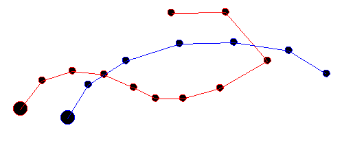
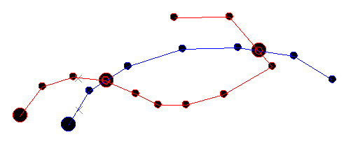

# break-string-with-string ("bks")

See this command in the [**command table**.](<commandtable_B.md#break-string-with-string>)

To access this command:

  * **Digitize** ribbon **> > Tools >> Break >> With String**.

  * Using the **[command line](<../COMMON/Command_Toolbar.md>)** , enter "break-string-with-string".

  * Use the quick key combination "bks".

  * Display the **[Find Command](<../COMMON/findcommand.md>)** screen, locate **break-string-with-string** and click **Run**.

## Command Overview

Break a string where it is crossed by another selected control string.

All string fragments created with this command stay within the original object.

Command steps:

  1. Run the command.

If a string is already selected, it becomes the 'control' string that is used to perform the 'cutting'. If no string is selected, you are asked to select a control string.

  2. Select the string that you wish to break. In the following example, the red string is cut by the blue string - the control string:

;>)

After the break - note the additional vertices introduced at the intersection points:

;>)

  3. Complete the command by double-clicking or tapping anywhere in a **3D** window.

Related topics and activities

  * [break-string ("bs")](<break-string.md>)

  * [break-strings ("bki")](<break-strings.md>)