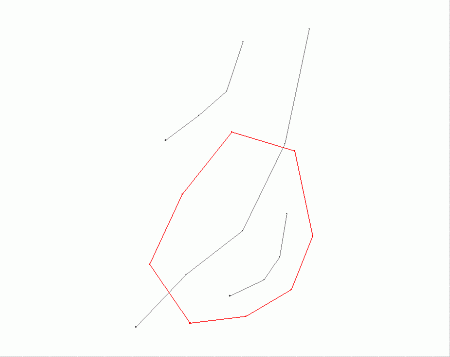
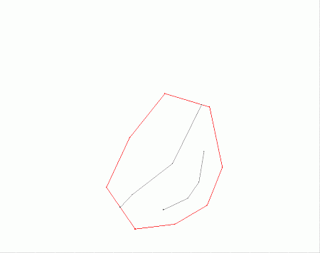

# clip-inside-perimeter ("cip")

See this command in the [**command table**.](<_COMMAND%20TABLE_C.md#clip-inside-perimeter>)

To access this command:

  * **Digitize** ribbon **> > Tools >> Clip Strings >> Clip Inside Perimeter**.

  * Using the **[command line](<../COMMON/Command_Toolbar.md>)** , enter "clip-inside-perimeter".

  * Use the quick key combination "cip".

  * Display the **[Find Command](<../COMMON/findcommand.md>)** screen, locate **clip-inside-perimeter** and click **Run**.

## Command Overview

Delete point and string data lying outside a selected perimeter.

**Note** : If string or point data is loaded but not displayed, it is not affected by this command.

In the following example, the red perimeter (closed string) is used to clip the grey string data.

Before clipping:

After clipping:

Command steps:

  1. In a 3D window, display both the string data to be clipped, and the closed perimeter string that will clip that data.

  2. Run the command.

  3. Following the prompt in the **Status** Bar, select the clipping perimeter (the closed string).

All string data outside the perimeter is removed.

  4. Click **Cancel** to close the command.

Related topics and activities

  * [clip-to-perimeter](<clip-to-perimeter.md>)

  * clip-inside-perimeter ("cip")

  * [clip-perimeters-to-perimeters ("cptp")](<clip-perimeters-to-perimeters.md>)

  * [clip-strings-to-perimeters ("cltp")](<clip-strings-to-perimeters.md>)

  * [trim-to-string ("tri")](<trim-to-string.md>)