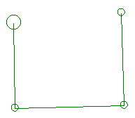
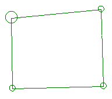

# close-string ("clo")

See this command in the [**command table**.](<_COMMAND%20TABLE_C.md#close-string>)

To access this command:

  * **Digitize** ribbon **> > Condition >> Close**.

  * Using the **[command line](<../COMMON/Command_Toolbar.md>)** , enter "close-string".

  * Use the quick key combination "clo".

  * Display the **[Find Command](<../COMMON/findcommand.md>)** screen, locate **close-string** and click **Run**.

## Command Overview

Select an open string, and create a closed perimeter by adding a segment linking the last and first string points.

You can preselect data before running this command; all preselected strings are closed without further prompts.

Running this command automatically cancels any other running command.

For example, consider the following open string:  
  
If closed, it becomes:  

**Tip** : once closed, the [query-string](<query-string.md>) command can be used to calculate the area enclosed by the perimeter.

**Note** : Subsequently moving string points may reopen the string (the first and last line points are not locked in position with each other).

Command Steps:

  1. Run the command. 

  2. What happens next depends on whether data is selected:

     * **If no strings are selected** , you are prompted to select data. 

     * **If strings are already selected** , they are closed without further prompts.

Already closed strings are not affected by this command.

Related topics and activities

  * [close-all-strings](<close-all-strings.md>)

  * [open-string](<open-string.md>)

  * [open-all-strings](<open-all-strings.md>)

  * [query-string](<query-string.md>)