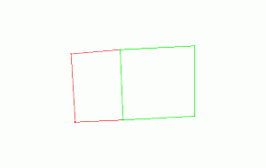
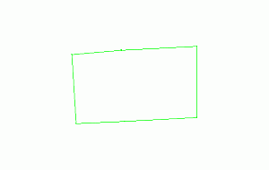

# combine-adjacent-perimeters ("cap")

See this command in the [**command table**.](<_COMMAND%20TABLE_C.md#combine-adjacent-perimeters>)

To access this command:

  * **Digitize** ribbon >> **Tools >> Combine >> Combine Adjacent**.

  * Using the **[command line](<../COMMON/Command_Toolbar.md>)** , enter "combine-adjacent-perimeters".

  * Use the quick key combination "cap".

  * Display the **[Find Command](<../COMMON/findcommand.md>)** screen, locate **combine-adjacent-perimeters** and click **Run**.

## Command Overview

Combine two perimeters (closed strings), which partially share a common boundary, into a single perimeter. The resulting perimeter contains the attributes from the first of the two selected strings.

Use this command with the [keep-combined-switch](<keep-combined-switch.md>) command as this determines whether the original string data is kept after strings have been combined. For example, below, the **Keep Originals** toggle is **unchecked**. The green string is selected first and the red string second:

The result:

Command steps:

  1. Run the command.

  2. Select the first perimeter.

  3. Select the second perimeter.

The selected perimeters are combined. Depending on the status of the [keep-combined-switch](<keep-combined-switch.md>) mode, the original data may or may not remain.

  4. Click **Cancel** to close the command.

Related topics and activities

  * [combine-strings](<combine-strings.md>)

  * [combine-strings-attrib](<combine-strings-attrib.md>)

  * [keep-combined-switch](<keep-combined-switch.md>)