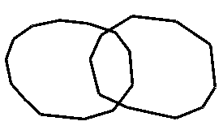
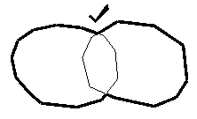
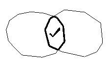
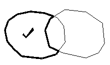
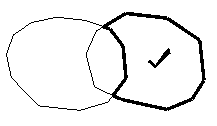

# combine-strings-attrib

See this command in the [**command table**.](<_COMMAND%20TABLE_C.md#combine-strings-attrib>)

To access this command:

  * Using the **[command line](<../COMMON/Command_Toolbar.md>)** , enter "combine-strings-attrib".

  * Display the **[Find Command](<../COMMON/findcommand.md>)** screen, locate **combine-strings-attrib** and click **Run**.

## Command Overview

Generates a single string from two overlapping strings whilst maintaining the attributes of the original strings.

This differs from the [combine-strings](<combine-strings.md>) command, which copies all attributes of the first string to the second as part of the combination process.

This command is used in conjunction with the [keep-combined-switch](<keep-combined-switch.md>) mode which dictates whether the original string data is kept when strings are combined.

Consider the following example, where **combine-strings** is used to generate inner and outer boundaries:  

Original string arrangements:

There are four possible outcomes:

Command steps

  1. Run the command.

  2. Select the portion of the first string which is to be included in the combination.

  3. Select the portion of the second string which is to be combined with the first portion.

  4. Click Cancel to close the command.

Related topics and activities

  * [combine-strings ("com")](<combine-strings.md>)