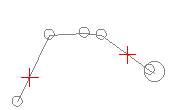
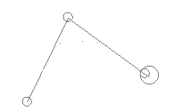

# converge-segments ("trc")

See this command in the [**command table**.](<_COMMAND%20TABLE_C.md#converge-segments>)

To access this command:

  * **Edit** ribbon **> > Condition >> Condition >> Trim Corners**.
  * **Digitize** ribbon **> > Condition >> Condition >> Trim Corners**.

  * Using the **[command line](<../COMMON/Command_Toolbar.md>)** , enter "converge-segments"

  * Use the quick key combination "trc".

  * Display the **[Find Command](<../COMMON/findcommand.md>)** screen, locate **converge-segments** and click **Run**.

## Command Overview

Remove unwanted string vertices by extrapolating two selected converging string segments to their point of intersection, creating a single vertex. 

Other vertices, between the original end points of the selected strings, are removed.

### Command Example

This command only applies to convergent segments, for example, selecting the two points as shown on the following string:  
  

results in the following line shape:

Command steps:

  1. Load, display and select the string to be modified.

  2. Run the command.

  3. Following the prompts in the Status Bar, select the first convergent segment on the required string.

  4. Select the second convergent segment on the same string.

  5. Click **Done** , or double click anywhere to close the command.

Related topics and activities

  * [smooth-string](<smooth-string.md>)

  * [ remove-string-crossovers](<remove-string-crossovers.md>)

  * [resolve-string-points](<resolve-string-points.md>)

  * [condition-string](<condition-string.md>)