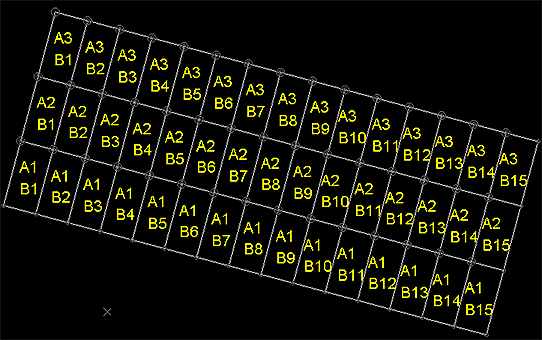

# create-grid-perimeter ("drg")

See this command in the [**command table**.](<_COMMAND%20TABLE_C.md#create-grid-perimeter>)

To access this command:

  * **Digitize** ribbon **> > Attributes >> From Perimeters >> Draw Grid**.

  * **Home** ribbon **> > Attributes >> From Perimeters >> Draw Grid**.

  * Using the **[command line](<../COMMON/Command_Toolbar.md>)** , enter "create-grid-perimeter"

  * Use the quick key combination "drg"

  * Display the **[Find Command](<../COMMON/findcommand.md>)** screen, locate **create-grid-perimeter** and click **Run**.

## Command Overview 

Generate a grid of closed, rectangular strings in a grid arrangement with (optionally) a unique X and Y attribute for each. 

A grid can be defined on any plane (but the result will always be planar, although can be edited afterwards) and each grid rectangle (from now no, referred to as a 'grid unit') can be assigned a incrementing or decrementing X or Y attribute. You get to choose the name of the X and Y attribute if you choose to add one to the output string data.

### Command Example

For example, in the image below, grid dimensions were configured as follows:

X **Length** = 10

X **Increments** = 3 

Y **Length** = 5

Y **Increments** = 15

Each grid square is prefixed with "A" for the X value and "B" for the Y value. Each grid unit starts at 1 and increments by 1 in the order it was created:

Note that attribute values don't (and aren't supposed to) correspond to coordinate positions, simply the order in which the grid cells were created. With an overall grid Azimuth of 15, the result is:

**Tip** : Restore previous screen settings using the Restore button to create similar grids to those already generated.

The combination of X and Y grid square attribution, in this case, means each square has a unique grid reference.

Command Steps:

  1. Display a **3D** window where the origin of your intended grid is visible.

**Tip** : Whilst it isn't required. it can be useful to either **[create a 3D section](<../VR_Help/Sections.md>)** that aligns with your intended grid, or rotate the 3D view so that it is positioned orthogonally (looking down on) the grid you're going to create. Otherwise, you can define the design plane for your grid using any orientation later.

  2. Run the command.

The **Draw Grid** screen displays.

  3. Define the **Plane** on which the grid is generated:

     * Choose a preset plane orientation; either **Horizontal** , **North-South** or East-West. The design section aligns with the selected major axis.

     * Extract the **Azimuth** and **Inclination** for the selected **3D Section**. You can pick any loaded 3D section using the list provided.

     * Choose an arbitrary **Azimuth** and **Inclination**.

  4. Choose the global **Parameters** for your grid:

     * If you know the coordinates, enter the **X** , **Y** and **Z** values for the bottom left position of your grid (as if viewed from above).

       * Alternatively, **Pick** any position in any **3D** window.

     * Enter the **Azimuth** value used to orient the grid. By default, a grid is generated with zero azimuth.

       * Alternatively, use **Pick** to select a point in the **3D** window from which an **Azimuth** is derived (based on its comparative position with the origin point).

  5. Enter the **Dimensions** of the grid units for your grid. **X** and **Y** dimensions are both specified in terms of **Length** and **Increments** , with the **Total Length** calculated automatically (which can't be edited). Enter the axis length and number in the specified direction directly into the table.

  6. (Optionally) assign **Attributes** to each grid unit string. 

This can be useful for labelling, say, where you have a particular drive layout and wish to annotate the grid using incrementing or decrementing values in each direction. **X** and **Y** attributes are set independently but are, essentially, added as a custom attribute to the output string. The values contained in these attributes may or may not relate to coordinate values, or may simply be grid references, unrelated to the world position of the grid unit strings.

For the **X** and **Y** attribute (if checked):

     1. Choose to enable attribute for the selected 2D axis by either checking **X Attribute** or **Y Attribute** (or both).

Once enabled, additional fields become available.

     2. Enter the **Name** of the attribute to add to your output string object. This must adhere to fixed **[attribute naming conventions](<../COMMON/Attribute_Naming_Convention.md>)** for your system.

     3. Which grid reference value do you wish to **Start from** for the selected axis? Enter a number here. This must be a positive integer.

     4. How should the grid reference increase for each grid unit? Set **in steps of** to denote the gap between grid reference values. For example, in a 5 x 5 grid , if one axis should be attributed 1, 2, 3, 4 and 5, the values should **Start from** "1" and change **in steps of** "1".

     5. If you want attribute values to be applied from the highest first, decrease to the lowest, choose **Reverse direction**.

  7. To add a custom **Prefix** or **Suffix** to your custom grid reference attribute(s), add the required text. Both are optional.

  8. **Preview** your grid in the **3D** window. Data shown at this stage is illustrative only - no object data has been created.

  9. Once you are happy with your **Preview** , choose how to store the output string data:

     * To store the grid data in the current string object, choose **Current Object**. Grid data is added to whatever data is already there.

     * Choose an existing, or specify a new data **Object** in which to store the grid.

  10. Click **Save** to generate grid data as specified.

Related topics and activities

  * [Attribute Naming Convention](<../COMMON/Attribute_Naming_Convention.md>)

  * [Create a 3D section](<../VR_Help/Sections.md>)