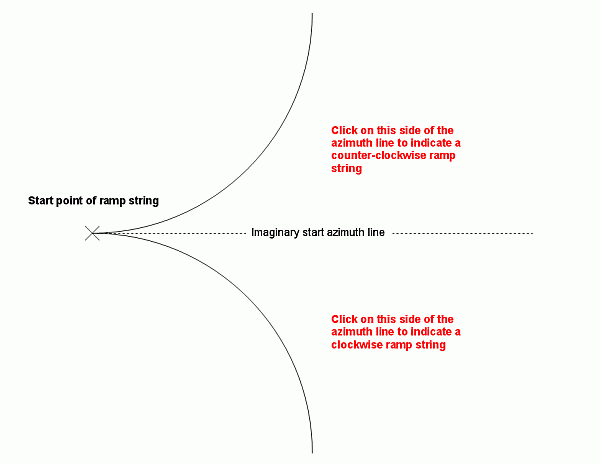

# create-ramp-string ("crs")

See this command in the [**command table**.](<_COMMAND%20TABLE_C.md#create-ramp-string>)

To access this command:

  * **Digitize** ribbon **> > Tools >> More >> Create Ramp**.

  * Using the **[command line](<../COMMON/Command_Toolbar.md>)** , enter "create-ramp-string"

  * Use the quick key combination "crs".

  * Display the **[Find Command](<../COMMON/findcommand.md>)** screen, locate **create-ramp-string** and click **Run**.

Draw a ramp string using a start point (selected interactively in a 3D window) and defined start azimuth, gradient, radius and other parameters.

## Command Overview

Draw a ramp string using a start point (selected interactively in any 3D window) and defined start azimuth, gradient, radius and other parameters.

If new object data is required (say, no string object previously existed), it is created when the command is run. 

To create a ramp string in a 3D window:

  1. Select the required snap and data selection settings using the Home ribbon's options.

  2. Run the **create-ramp-string** command to display the Create Ramp String screen.

  3. Select the start point of the ramp in the 3D window.

The **Create Ramp String** screen displays.

Tip: if suitable reference data, such as a pit base string, is displayed, consider snapping to that string to ensure the correct starting elevation.

  4. Enter the Start Azimuth of the ramp. You can also enter an absent value ("-") meaning an azimuth of zero (North) is used.

**Note** : if you previously snapped to a string to create a starting point, the azimuth of the snapped string section is displayed by default, but can be changed.

  5. Enter the Gradient of String and the convention to be used (degrees, % or ratio).

  6. Ramps can either be straight or curved. 

     * Select a Straight ramp type to project the ramp string in a straight line from the starting position or;

     * Select Radius and enter the turning radius to determine the severity of the curve, where larger values produce shallower curves.

  7. Specify where the ramp will end, using End Limit options:

     * End Azimuthstop the ramp when it reaches the specified target azimuth. 
     * Half Circlecontinue the ramp curve throughout a half circle (180 degrees).

     * Quarter Circlecontinue the ramp curve for a quarter circle.

     * Continue the ramp for a specified **Distance**. If this is selected, you must also choose whether the ramp overall distance is measured over a Horizontal or Vertical plane, or along the gradient of the generated string (Slope).

  8. Select if the ramp is to curve (according to a plan view) in a Clockwise or Counter-clockwise direction.

  9. Choose the resolution of points in your ramp curve by specifying either the Segments in a full circle (default = 40) or the Segment length. Segment length is always calculated based on the slope distance, not the horizontal distance. 

**Note** : increasing the number of **Segments in a full circle** will generally provide a smoother curve, whilst decreasing the **Segment length** has the same effect. In more detail: If the first point of a ramp is snapped to an existing string, the starting azimuth of the ramp string will be calculated based on the string to which the origin was snapped. If the snapping point is the first point of the guide string, the azimuth will be the opposite direction of the first edge, otherwise the azimuth will be set to the azimuth of the guide string edge.

  10. If defining a **Curved** ramp and **Radius** is not zero (see above), you are prompted to pick the direction of your ramp in a 3D window:

Click either one or the other side of an imagined start azimuth line, either to the right or left of the ramp's starting position, for example:

;>)

  11. The ramp string displays. The command remains active so you can make modifications to the design parameters and update the ramp-in-progress.

  12. Click **Add** to start a new ramp, or click **Cancel** (or **Done** on the main screen) to close the command.

Related topics and activities

  * [Create Ramp String](<../COMMON/Create%20Ramp%20String.md>) (screen)