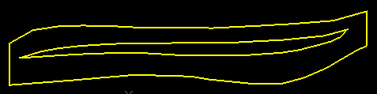
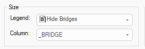
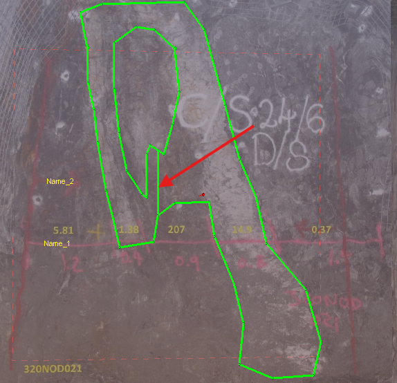
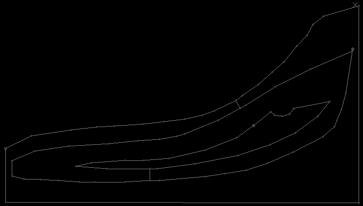
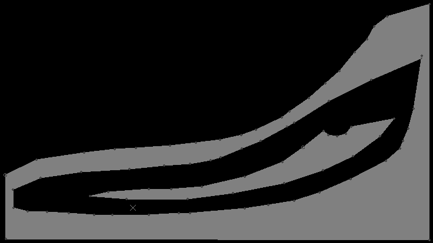

# digitise-doughnut ("dnn")

See this command in the [**command table**.](<COMMAND%20TABLE_D.md#digitise-doughnut>)

To access this command:

  * Using the **[command line](<../COMMON/Command_Toolbar.md>)** , enter "digitise-doughnut".

  * Use the quick key combination "dnn".

  * Display the **[Find Command](<../COMMON/findcommand.md>)** screen, locate **digitise-doughnut** and click **Run**.

Create a complex string representing an external structure and one or more internal voids.

A 'doughnut' string is formed from the interaction of a single, external, closed string and one or more closed, non-overlapping strings that are fully encapsulated within the external string. No data can contain crossovers.

Data must be selected before running the command, and data is created in the current string object.

The order of data selection is not important, and the command is unaffected by the current view direction or section orientation. Both external and internal string data must be formed of a single, continuous closed string trace.

Tip: Close string data before selecting it using the close-string ("clo") or close-all-strings ("cla") commands.

For example, the following image shows the input and output of a simple use of the command:

;>)

;>)

## "Bridge" Strings

**Digitize-doughnut** outputs a single string comprising the outer perimeter and all internal perimeters.

The internal void(s) that appear are actually connected to other internal structures and the external perimeter by invisible 'bridge' strings. These are hidden by default (through a custom 3D display legend that controls the width of bridge strings, setting them to zero). As such, doughnut strings are still suitable for evaluation and other bounding purposes (such as in implicit modelling). 

The name of the legend created by the digitise-doughnut command is called "Hide Bridges", and you can easily expose these bridge strings simply by applying a different legend, for example, using the [3D String Properties](<../VR_Help/Traces%20Properties%20Dialog%20\(Edge%20Visual\).md>) screen to set a fixed colour for the string. 

For example, this image shows the exposed bridge string of a map feature created in Studio Mapper:

;>)   

## Command Storage Modes

The output of this command is dependent on the current status of [doughnut-storage-switch ("ddss")](<doughnut-storage-switch.md>) (quick keys "dss"). You can either:

  * **Modify** the outer perimeter string trace so it becomes the 'doughnut'. This means your original string data is modified. Internal perimeter data, in the same or different objects, is not modified.
  * **Create** all doughnut string data in the current string object, as new string data. This preserves the original data (outer perimeter and internal strings).

Tip: To fully isolate the generated doughnut string, create a new string object and make it current, before running the command.

See [doughnut-storage-switch ("ddss")](<doughnut-storage-switch.md>)

## Nested Structures

You can generate multiple 'layers' of nesting with this command. For example, you can have multiple, concentric structures. In each case, a complex structure is formed between an outer layer and the adjacent inner layer. You can then delete structures if you wish. In the example below, the first image shows the result of incorporating 3 closed strings, and bridge strings have been artificially exposed. The second image shows the same data as filled strings, with the middle 'ring' deleted.

;>)

;>)

Tip: When working with multiple concentric data, using the 'Filled' 3D string format to more clearly see the structures contained in the output data. 

Tip: You can also select multiple disconnected (non-concentric) internal closed string data to produce multiple voids in an external structure.

Command steps

  1. Digitise or load closed string data.

  2. Select non-overlapping external and internal closed strings. No data can contain crossovers.

  3. Run the command.

Complex string data is formed between each set of enclosed data. 

Related topics and activities

  * [doughnut-storage-switch ("ddss")](<doughnut-storage-switch.md>)

  * [close-string ("clo")](<close-string.md>)

  * [close-all-strings ("cla")](<close-all-strings.md>)

  * [generate-outlines-attrib](<generate-outlines-attrib.md>)

  * [outline-storage-switch ("tsif")](<outline-storage-switch.md>)