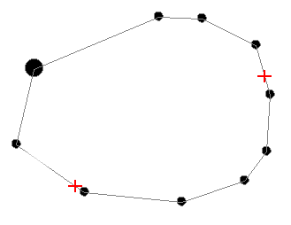
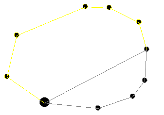

# divide-string ("sdi")

See this command in the [**command table**.](<COMMAND%20TABLE_D.md#divide-string>)

To access this command:

  * **Digitize** ribbon **> > Tools >> Break >> Divide Outline String**.

  * Using the **[command line](<../COMMON/Command_Toolbar.md>)** , enter "divide-string"

  * Use the quick key combination "sdi".

  * Display the **[Find Command](<../COMMON/findcommand.md>)** screen, locate **divide-string** and click **Run**.

## Command Overview

Divides an outline (closed string) into 2 outlines. All string fragments created with this command will stay within the original object. The broken segments are not moved to another object nor is a new object created.

String data can either be selected beforehand or during the command

The image below shows an example string. The red crosses indicate the first and second break points - the order in which they are applied is not relevant.

  
   
  

The string outline is reformed, creating two separate closed strings, e.g.:  
  

Command steps:

  1. Select the string to be divided.

  2. Run the command.

  3. Select the first point of the closed string.

  4. Select the second point.

The closed string is subdivided. 

Related topics and activities

  * [close-string](<close-string.md>)

  * [break-string](<break-string.md>)

  * [break-string-with-string](<break-string-with-string.md>)