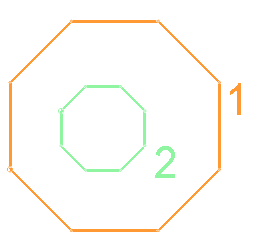
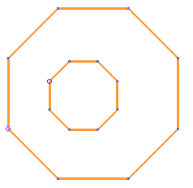

# doughnut-storage-switch ("ddss")

See this command in the [**command table**.](<COMMAND%20TABLE_D.md#doughnut-storage-switch>)

To access this command:

  * Using the **[command line](<../COMMON/Command_Toolbar.md>)** , enter "doughnut-storage-switch".

  * Use the quick key combination "ddss".

  * Display the **[Find Command](<../COMMON/findcommand.md>)** screen, locate **doughnut-storage-switch** and click **Run**.

Choose how data is stored when it is generated by the [digitise-doughnut ("dnn")](<digitise-doughnut.md>) command. This switch does not affect any other string generation commands.

Running this command swaps doughnut data storage modes between the following states:

  * **Modify** the outer perimeter string trace so it becomes the 'doughnut'. This means your original string data is modified. Internal perimeter data, in the same or different objects, is not modified.

  * **Create** all doughnut data in the current string object, as new string data. This preserves the original data (outer perimeter and internal strings).

For example, the following string object has two string traces:

If **doughnut-storage-switch** is set to **Modify** mode, the outer perimeter of the string changes to this:

The green internal string (2) is still there (it's just 'behind' modified perimeter above).

If **doughnut-storage-switch** is set to **Create** mode, the outer perimeter is unchanged, and a new 'doughnut' string is created in the current string object instead. This means you still have access to the original outer perimeter. In the example above, you end up with 3 independent strings: 1, 2 and a new combined doughnut (3).

Note: To control how outline data is generated for commands like [generate-outlines ("ou")](<generate-outlines.md>) use [outline-storage-switch ("tsif")](<outline-storage-switch.md>).

Related topics and activities

  * [digitise-doughnut ("dnn")](<digitise-doughnut.md>)

  * [generate-outlines ("ou")](<generate-outlines.md>)

  * [generate-outlines-attrib](<generate-outlines-attrib.md>)

  * [outline-storage-switch ("tsif")](<outline-storage-switch.md>)