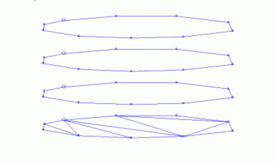

# end-link ("eli")

See this command in the [**command table**.](<COMMAND%20TABLE_E.md#end-link>)

To access this command:

  * Explicit ribbon **> >**Create >> End Linka

  * Using the **[command line](<../COMMON/Command_Toolbar.md>)** , enter "end-link"

  * Use the quick key combination "eli".

  * Display the **[Find Command](<../COMMON/findcommand.md>)** screen, locate **end-link** and click **Run**.

## Command Overview

Creates a wireframe link by closing a single perimeter.

In the example below, one end in a sequence of perimeters has been closed using end-link:

In order to create a closed wireframe volume, the other end perimeter would be closed using the same command and the intermediate perimeters would be linked using [link-strings](<link-strings.md>).

Note: The selected perimeter must not contain any cross-overs. 

Note: This command uses the **Maximum Segment Length** value (if greater than zero), as specified in **[Wireframe Linking Settings](<../COMMON/Project%20Settings_%20Wireframe%20Linking.md>)** to limit the generated segment length of generated wireframe triangles.

Command steps:

  1. If required, preselect a perimeter string.

  2. Run the command.

  3. If data wasn't previously selected, select the required end perimeter and repeat for other end perimeter(s). Click Cancel to complete.

  4. If data was previously selected, it is automatically end linked and the command exits.

Related topics and activities

  * [link-strings](<link-strings.md>)

  * [link-single-outline](<link-single-outline.md>)

  * [link-selected-outlines](<link-selected-outlines.md>)

  * [link-outline-pair](<link-outline-pair.md>)

  * [link-multiple-strings](<link-multiple-strings.md>)