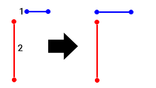
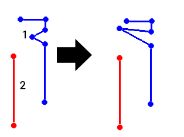

# extend-segment-virtual-intersect ("esv")

See this command in the [**command table**.](<COMMAND%20TABLE_E.md#extend-string-to-string>)

To access this command:

  * **Digitize** ribbon **> > Edit >> Extend Segment**.

  * Using the **[command line](<../COMMON/Command_Toolbar.md>)** , enter "extend-string-virtual-intersect"

  * Use the quick key combination "esv".

  * Display the **[Find Command](<../COMMON/findcommand.md>)** screen, locate **extend-string-virtual-intersect** and click **Run**.

## Command Overview

Extend a string segment to virtually intersect a second segment of another selected string.

  * The string is extended from any segment of the target string. This doesn't have to be the start or the end segment.

  * Data preselection is supported; if string data is already selected when the command is run, only selected data can be picked for the target or the destination string.

This command differs from the **[extend-string-to-string](<extend-string-to-string.md>)** command in that, if a projected segment doesn't intersect the target string, the target string is extended 'virtually' (either at the start or the end) to allow an intersection to occur. The target string isn't actually modified.

**Note** : You can use this command on both open and closed strings.

### Example

Consider the following example, where the target string (the one to be modified, shown in blue) is extended to the destination string, shown in red.

Note how the target string extends into empty space, but reaches a point at which it would intersect with the destination string if it were extended at one end. 

The same applies if intersecting a segment somewhere in the middle of a target string:

Consider a string's _direction_ if modifying an internal vertex; the adjusted node is projected at a bearing and dip dictated by the _following_ edge. That is, the orientation of the edge in front of the picked point is maintained. Reversing the string and pick the same point adjusts the string using the same rules, but may give a different final result.

Command steps:

  1. Run the command.

  2. Select the string vertex to be extended.

  3. Select the string to which the vertex should be extended.

  4. The command mode remains active, so the above steps can be repeated for multiple string segment extensions.

  5. Click **Done** to exit the command.

Related topics and activities

  * [extend-string ("ext")](<extend-string.md>)

  * [extend-string-to-string](<extend-string-to-string.md>)

  * [reverse-string](<reverse-string.md>)