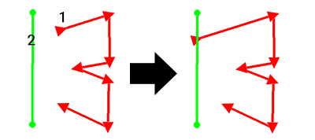
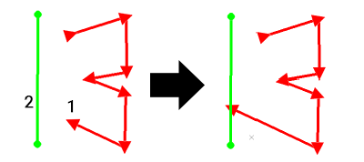
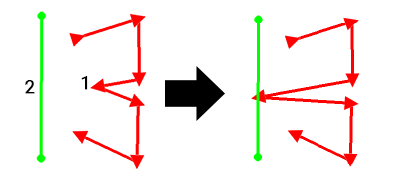

# extend-string-to-string ("ess")

See this command in the [**command table**.](<COMMAND%20TABLE_E.md#extend-string-to-string>)

To access this command:

  * Digitize ribbon >> Edit >> Extend Segment >> Extend Segment to String

  * Using the **[command line](<../COMMON/Command_Toolbar.md>)** , enter "extend-string-to-string"

  * Use the quick key combination "ess".

  * Display the **[Find Command](<../COMMON/findcommand.md>)** screen, locate **extend-string-to-string** and click **Run**.

## Command Overview

Extends a string from any segment, using the bearing and dip of the final segment, to a point where it meets another selected string. This is not necessarily an intersection as the strings may be in different planes.

Data can be extended to other string traces within the same object, or different objects. 

If you wish to restrict the scope of string extension to a particular group of data (or even a single string if you want to extend a part of it to itself), you can preselect data. If data is preselected, you can only pick target and destination string data from within the selected group. If no data is selected, you can pick any visible string data to extend to any other visible data.

You aren't restricted to extending start and end points of a string; picking an internal string segment (on the string to be extended) is fine; if it is possible to extend the chosen segment (in either direction) to intersect with a target string, that segment by shifting one of the string nodes along the target segment's bearing and dip.

### Command Examples

Consider the following examples. In all examples, two string objects exist (onlyto make them easier to distinguish via formatting) and in each case, the red string is extended to intersect with the green string. String symbols are exaggerated for clarity, with arrow symbols showing the red string's direction.

In each case, (1) represents a response to the command's instruction "Pick a segment to extend from on any string" and (2) is a response to "Pick any string to extend to."

Command steps:

  1. Run the command. If no string is selected, you are asked to select the string segment to be extended, using the cursor. The bearing and dip of the string segment are used for the extension.

  2. Now select a second string (left or right click) to define the end of the extension. The function will check whether the strings will actually cross-over and the first string segment is extended to the intersection point with the second.

  3. The command mode remains active, so the above steps can be repeated for multiple string segment extensions.

  4. Click **Done** to exit the command.

Related topics and activities

  * [extend-string](<extend-string.md>)

  * extend-string-to-string ("ess")

  * [extend-segment-virtual-intersect ("esv")](<extend-segment-virtual-intersect.md>)