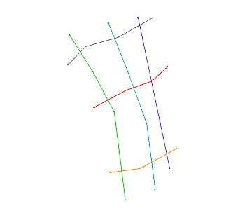
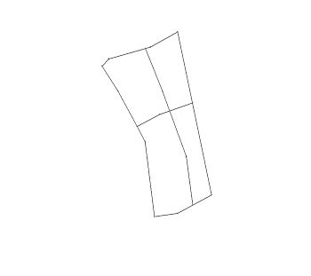
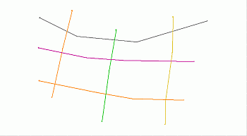
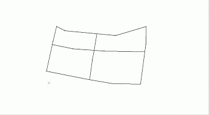

# generate-outlines ("ou")

See this command in the [**command table**.](<COMMAND%20TABLE_G.md#generate-outlines>)

To access this command:

  * **Edit** ribbon **> > Shapes >> Outlines >> Generate Outlines without Attributes**.

  * **Digitize** ribbon **> > Create >> Outlines**.

  * **Draw (Features)** ribbon **> > Outlines >> Generate**.

  * **Draw (Profiles)** ribbon **> > Outlines >> Generate**.

  * Using the **[command line](<../COMMON/Command_Toolbar.md>)** , enter "generate-outlines"

  * Use the quick key combination "ou".

  * Display the **[Find Command](<../COMMON/findcommand.md>)** screen, locate **generate-outlines** and click **Run**.

## Command Overview

Generate outlines (perimeters) from areas defined by multiple crossing strings.

The strings used to create outlines must lie completely within the current clipping limits. A string will not be used if any point on that string is outside the clipping limits. If there is a current string filter this is applied. Only currently displayed strings are used to generate the outlines.

The resultant outlines (strings) have LSTYLE set to '1001', SYMBOL set to '201 and COLOUR set to '1''.

The state of the [outline-batch-switch](<outline-batch-switch.md>) and the [outline-storage-switch](<outline-storage-switch.md>) determine how new outlines are generated and stored. The former option can be set in [Project Settings](<../COMMON/ProjectSettings.md>). 

Once generated, outlines can be checked with [query-string](<query-string.md>) to calculate and display the total length and area of individually selected outlines in the Output window.

Command steps:

Note: The steps below assume that [outline-batch-switch](<outline-batch-switch.md>) is toggled OFF (default) and that [outline-storage-switch](<outline-storage-switch.md>) is toggled ON (default).

  1. Display the required strings object in the data window.

  2. Run the Command.

  3. Follow the prompts in the left side of the Status Bar for the steps below.

  4. In any 3D window, select (left-click) inside an enclosed area around which an outline should to be generated.

  5. Check that an outline is generated for the selected area.

  6. Repeat steps 4 and 5 for each enclosed area.

  7. Click Cancel.

  8. In the Loaded Data and Sheets control bars check that a new new Outlines object has been created using default COLOUR, LSTYLE and SYMBOL values.

## Outline Generation Examples

#### Example: Batch switch off and storage switch on

In the following example, a set of crossing strings is used to generate outlines by individually selecting enclosed areas; the resultant outlines are stored in a new New Outlines object.

The original set of crossing strings:

The resultant outlines stored in the new strings object:

#### Example: Batch switch on and storage switch off

In the following example, a set of crossing strings is used to generate a set of all possible outlines.

The original set of crossing strings:

The resultant outlines were generated without selecting any crossing strings and replaced the original strings in the strings object:

Related topics and activities

  * [outline-batch-switch](<outline-batch-switch.md>)

  * [ outline-storage-switch](<outline-storage-switch.md>)

  * [generate-outlines-attrib](<generate-outlines-attrib.md>)