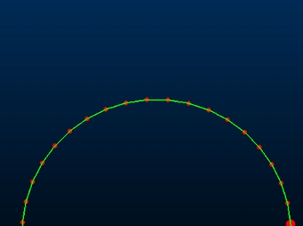
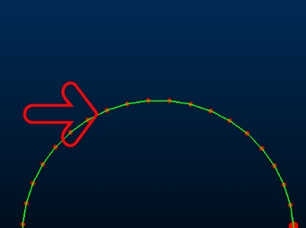
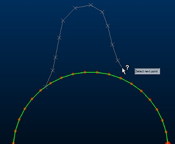
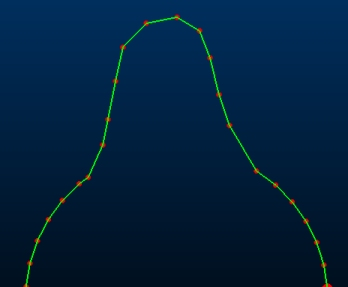
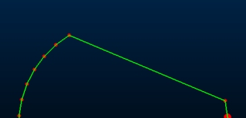

# insert-line ("ils")

See this command in the [**command table**.](<COMMAND%20TABLE_I.md#insert-line>)

To access this command:

  * **Digitize** ribbon **> > Edit >> Replace with String**.

  * Using the **[command line](<../COMMON/Command_Toolbar.md>)** , enter "insert-line"

  * Use the quick key combination "ils".

  * Display the **[Find Command](<../COMMON/findcommand.md>)** screen, locate **insert-line** and click **Run**.

## Command Overview

Insert vertices (string points) into or removes vertices from the selected string by digitizing a new line segment between nominated start and end positions.

As this command replaces a section of a string with newly-digitized points, it can be used to both insert new points or remove points (by replacing with fewer points). In either case, the shape of the line is adjusted as soon as a new segment start and end position can be determined.

A new string section is applied once the same string has been targeted twice; the first time the string is selected indicates the beginning of the replacement section and the second indicates the end position. The segment of line between the two points is replaced with the newly-digitized data.

**Note** : String attributes are unaffected by this command: the original string attributes persist throughout the newly-digitized points.

How inter-string data is formed depends on how you pick your first and successive string points:

  * **If the first point is selected with a left mouse-click** , the first string point will snap to the closest string edge (restricted to selected strings if any are present).
  * **If the first point is a right click** , the point will snap to the closest edge, unless the [snap mode](<../COMMON/Selecting3DDataInteractively.md>) had been set to Snap to Points, in which case it will snap to the closest string point (restricted to selected strings if any are present).
  * **Subsequent left or right clicks** determine new points to be inserted into the string, using the standard new-string behaviour (left-click to plane, right-click snapping). These points and the lines between them, and from the last point to the cursor, are shown as a preview.

When a subsequent pick is a right-click snap to the original string, or is a left-click within the standard picking distance of the original string, the command will insert the new points between the first and final points selected on the original string. New edges use the existing string attributes.

  * **For closed strings** , the inserted line replaces the clockwise portion of the original string.

**Note** : Insert-line can be used in conjunction with [rapid-digitize-switch](<rapid-digitize-switch.md>) . 

### Example 1 - Point Insertion

  1. Original line shape:

;>)

  2. Run the command insert-line.

  3. Left mouse-click the position shown (left mouse-clicking snaps to the nearest string edge):

;>)

  4. Digitize new line vertices on either side of the original line, for example:

;>)

  5. Right-click one of the original string vertices to complete the edit and replace the original string segment with the new data:

;>)

### Example 2 - Point Deletion

In this example, string data is removed by introducing a flat line segment (2 points) between two of the original string vertices.

  1. Original line shape:

  2. Run the command insert-line.

  3. Right mouse-click the position shown (this will snap the start point to the closest string vertex):

  4. Right click a remote string vertex to introduce a straight line into the shape, removing the original points between the two clicks:

Related topics and activities

  * [insert-point-segment-center](<insert-point-segment-center.md>)

  * [edit-coincident-points-switch](<edit-coincident-points-switch.md>)

  * [delete-points-mode](<delete-points-mode.md>)

  * [select-string](<select-string.md>)

  * [insert-near-points](<insert-near-points.md>)

  * [insert-points-mode](<insert-points-mode.md>)

  * [insert-point-segment-center](<insert-point-segment-center.md>)

  * [rapid-digitize-switch](<rapid-digitize-switch.md>)

  * [snap mode](<../COMMON/Selecting3DDataInteractively.md>)