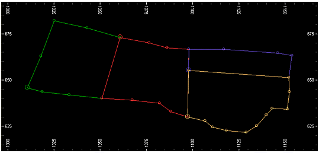
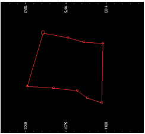
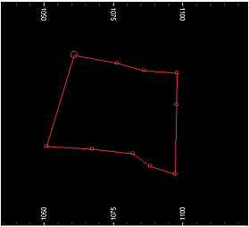

# insert-near-points ("inp")

See this command in the [**command table**.](<COMMAND%20TABLE_I.md#insert-near-points>)

To access this command:

  * **Digitize** ribbon **> > Condition >> Condition >> Insert Near Points**.

  * Using the **[command line](<../COMMON/Command_Toolbar.md>)** , enter "insert-near-points"

  * Use the quick key combination "inp".

  * Display the **[Find Command](<../COMMON/findcommand.md>)** screen, locate **insert-near-points** and click **Run**.

## Command Overview

Inserts points on selected strings where the edge passes within a tolerance distance of other selected strings points.

The tolerance distance is the minimum distance an edge may be from an existing string point without an additional point being added.

#### Command Example

The following image represents a set of strings before the command is run:

Note the state of the middle (red) closed string:

After running the command with all strings selected, the red closed string updates to include an extra point:

Related topics and activities

  * [smooth-string](<smooth-string.md>)

  * [converge-segments](<converge-segments.md>)

  * [condition-string](<condition-string.md>)

  * [remove-string-crossovers](<remove-string-crossovers.md>)

  * [resolve-string-points ("resp")](<resolve-string-points.md>)