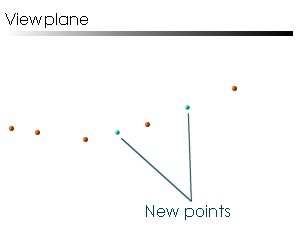

# insert-point-segment-center ("ipsc")

See this command in the [**command table**.](<COMMAND%20TABLE_I.md#insert-point-segment-center>)

To access this command:

  * **Home** ribbon **> > Edit >> Insert Points >> Insert at Center**.

  * **Explicit** ribbon **> > Design >> Insert Points >> Insert at Center**.

  * **Digitize** ribbon **> > Edit >> Insert Points >> Insert at Center**.

  * Using the **[command line](<../COMMON/Command_Toolbar.md>)** , enter "insert-point-segment-center"

  * Use the quick key combination "ipsc".

  * Display the **[Find Command](<../COMMON/findcommand.md>)** screen, locate **insert-point-segment-center** and click **Run**.

## Command Overview

Creates a point at the mid-point of a selected string segment. You can pre-select string data to constrain the strings into which points can be added, otherwise, any strings can be modified.

### Point Depth Interpolation

Inserting points in a 2D graphical environment (computer screen) when working in 3D space, requires the interpolation of a third dimension. The position of the point is calculated as a mean interpolation of neighbouring screen points, for example.

For example, suppose the 3D window's view plane is horizontal at an elevation of zero. Suppose also there is a string with each of its Z coordinates at 10. If a point is inserted then its Z coordinate will be added at an elevation of 10.

Command steps:

  1. Select the required string.

  2. Run the command.

  3. Click to place the new points.

  4. Click Done.

Related topics and activities

  * [insert-points-mode ("ipo")](<insert-points-mode.md>)

  * [edit-coincident-points-switch](<edit-coincident-points-switch.md>)

  * [delete-points-mode](<delete-points-mode.md>)

  * [select-string](<select-string.md>)

  * [move-points-mode ("mpo")](<move-points-mode.md>)