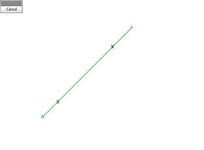
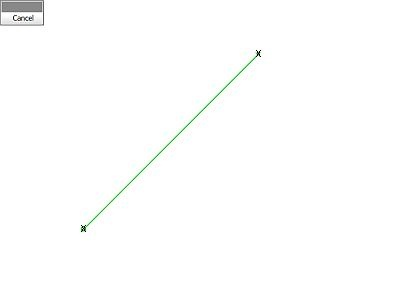
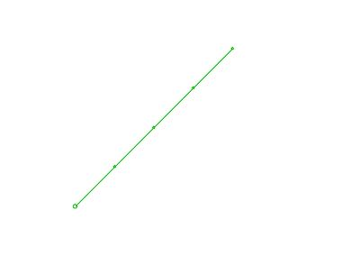

# insert-by-segment-length ("ibl")

See this command in the [**command table**.](<COMMAND%20TABLE_I.md#insert-by-segment-length>)

To access this command:

  * **Digitize** ribbon **> > Condition >> Condition >> Insert by Length**.

  * Using the **[command line](<../COMMON/Command_Toolbar.md>)** , enter "insert-by-segment-length"

  * Use the quick key combination "ibl".

  * Display the **[Find Command](<../COMMON/findcommand.md>)** screen, locate **insert-by-segment-length** and click **Run**.

## Command Overview

Insert new vertices into a selected string, between the selected start and end points, using the defined segment and offset parameters.

Data can either be selected before running the command, or interactively during the command session. 

**Note** : This command honours snap settings. Snapping uses the currently defined snap settings . Snapping provides additional control when selecting the start and end points on the selected string. Left click to select a point on the string which is closest to the cursor. See [Snap Mode](<../COMMON/SnapSettings.md>).

New vertices are added between the selected points at the specified segment length or number of segments, using an optional first offset. The following combinations of parameters are allowed, with the offset being optional in all cases:

  * Both the length and number of segments are defined.

  * If only the segment length is defined, the length of the string, between the selected start and end points, minus the optional offset, is divided into segments of the specified length.

  * If only the number of segments is specified, the length of the string, between the selected start and end points, minus the optional offset, is divided into the specified number of segments.

The offset defines the distance between the chosen start point and the first inserted vertex.

#### Command Examples

In the following example, points have been inserted in the 200m long string using a 50m spacing, by selecting without snapping (left-click) at the two points shown below. The result is shown on the right:

;>) ;>)

In the following example, points have been inserted in the 200m long string using a 50m spacing, by snapping (right-click) to the string start and end vertices:

;>) ;>)

Command steps:

  1. Run the command.

  2. Select the start point on the required string.

  3. Select the end point on the same sting.

The Segment Properties screen displays.

  4. Define the Segment length to be created by adding a new point, the Number of segments to create and the First offset, being the distance from the first string point at which a the first new point is added.

  5. Click OK.

  6. Click Done to complete the command.

Related topics and activities

  * [insert-at-intersections](<insert-at-intersections.md>)

  * [insert-curve ("ics")](<insert-curve.md>)

  * [insert-line ("ils")](<insert-line.md>)

  * [insert-near-points](<insert-near-points.md>)

  * [insert-segment-intersect ("isgi")](<insert-segment-intersect.md>)