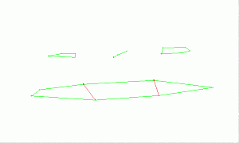
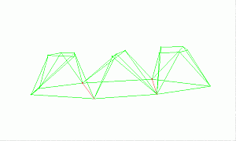

# link-boundary-to-line ("lbl")

See this command in the [**command table**.](<COMMAND%20TABLE_L.md#link-boundary-to-line>)

To access this command:

  * **Explicit** ribbon **> > Create >> Link >> Link Boundary to Line**.

  * Using the **[command line](<../COMMON/Command_Toolbar.md>)** , enter "link-boundary to Line"

  * Use the quick key combination "lbl".

  * Display the **[Find Command](<../COMMON/findcommand.md>)** screen, locate **link-boundary to Line** and click **Run**.

## Command Overview

Creates a wireframe link between a perimeter (closed strings) and a string, honouring any boundary or bridge strings on the perimeter.

**Note** : a _bridge_ string is a string that has both its first and last points connected to points on one of the two strings which are to be linked. It is not necessary to select a bridge string, as these are automatically detected during the linking process.

This command is used when creating bifurcated or split wireframes.

  * At least one of the two strings selected for linking must have at least one bridge string connected to it.

  * More than one bridge string may be connected to a string for linking.

  * If the line is specified with the minimum number of points, then additional points be can generated in the link with the new point separation (**[dtm-new-point-separation](<dtm-new-point-separation.md>)**) command to improve the triangle shape.

  * The tag or boundary or bridge strings must have their end points snapped (point or line) to a perimeter.

  * Bridge strings can contain any number of points and be fully three dimensional, but their end points must be connected to points on one of the selected strings. Crossovers of bridge strings should be avoided. The bridge strings themselves are not selected when running this command, they are automatically detected.

  * The links take their colour from the first string of each string-pair used for the linking.

### Link Boundary to Line Example

In the example below, the bottom perimeter is linked to the top two outside perimeters, using the link-boundary command, while the top middle string is linked using the **link-boundary-to-line** command, honouring the red boundary strings:

The resultant wireframe links look like this:

### Using the 3D Solid linking method

If you have strings on adjacent sections that are to be linked together, and those strings cross each other when viewed in the direction of wireframing, then temporary vertices are inserted into the string and these temporary vertices are used when the wireframe is created. Since pairs of strings are wireframed at a time it is possible for these temporary vertices to be created for one pair of strings and not the other. In this situation a wireframe may be built which contains inconsistencies. 

Therefore, the 3D-Solid method is not suitable for use with the older linking commands if adjacent sections contain strings that cross each other in the direction of wireframing.

See [**3D Solid linking method**.](<../COMMON/3D%20Solid%20Linking%20Method.md>)

## How to use

  1. To preserve existing wireframe data, in the Current Objects toolbar, select or create a new current wireframe object. Alternatively, add wireframe data to the current wireframe object.

**Note** : if no wireframe object exists yet, a new one is created automatically by this command.

  2. Load perimeter strings.

  3. Run the **link-boundary** command.

  4. Following the prompts in the Status Bar, select a first point on a perimeter (the one which has associated boundary or bridge strings).

  5. Select a second string.

**Note** : an error is reported if the first string is not a perimeter (closed string), or the second string is not open.

  6. Click Cancel to complete the command.

  7. Link the remaining perimeters or strings using the related link-boundary-to-line, [end-link-boundary](<end-link-boundary.md>) or other string linking commands.

Related topics and activities

  * [dtm-new-point-separation ("nps")](<dtm-new-point-separation.md>)

  * [link-boundary](<link-boundary.md>)

  * [end-link-boundary](<end-link-boundary.md>)