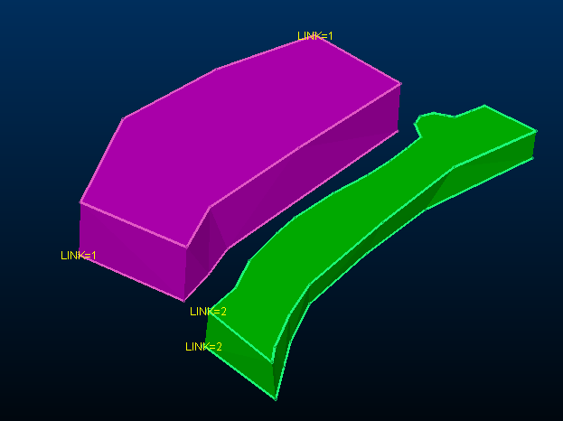

# link-outline-pair-attribute ("l3o")

See this command in the [**command table**.](<COMMAND%20TABLE_L.md#link-outline-pair-attribute>)

To access this command:

  * Explicit ribbon >> Create >> Link Pair >> Link Pair by Attribute
  * Using the **[command line](<../COMMON/Command_Toolbar.md>)** , enter "link-outline-pair-attribute"

  * Use the quick key combination "l3o".

  * Display the **[Find Command](<../COMMON/findcommand.md>)** screen, locate **link-outline-pair-attribute** and click **Run**.

## Command Overview

Link multiple strings with a common attribute together to create a wireframe. This command is similar to [link-outline-pair ("l2")](<link-outline-pair.md>) but uses a common attribute from at least two strings to create wireframe surfaces within the area described by each string. If an input string is not closed, a straight line is formed between the endpoints to complete a boundary.

The linking attribute is transferred to the output wireframe.

### Using the 3D Solid linking method

If you have strings on adjacent sections that are to be linked together, and those strings cross each other when viewed in the direction of wireframing, then temporary vertices are inserted into the string and these temporary vertices are used when the wireframe is created. Since pairs of strings are wireframed at a time it is possible for these temporary vertices to be created for one pair of strings and not the other. In this situation a wireframe may be built which contains inconsistencies. 

Therefore, the 3D-Solid method is not suitable for use with the older linking commands if adjacent sections contain strings that cross each other in the direction of wireframing.

See [**3D Solid linking method**.](<../COMMON/3D%20Solid%20Linking%20Method.md>)

Command steps:

  1. In the Current Objects toolbar, select or create a new current wireframe object.

  2. Before running the command select at least two strings with a common attribute.

  3. Run the command.

  4. Enter the name of the **Attribute to define pairs**. For example, if a LINK attribute value is assigned to two or more string entities within a string object, those string traces are regarded as being part of the same output wireframe. If multiple attribute values exist, potentially multiple closed wireframe volumes are created when the command is run.

For example, a string file contains four closed strings with two distinct LINK values. Running link-outline-pair-attribute and selecting LINK generates the following output:

;>)

  5. Click **OK**.

Wireframe data is generated in the current wireframe object.

Related topics and activities

  * [link-outline-pair ("l2")](<link-outline-pair.md>)

  * [link-boundary ("lbo")](<link-boundary.md>)

  * [link-boundary-to-line ("lbl")](<link-boundary-to-line.md>)

  * [create-drive ("cdr")](<create-drive.md>)

  * [end-link ("eli")](<end-link.md>)

  * [end-link-boundary ("elb")](<end-link-boundary.md>)

  * [end-link-selected-strings](<end-link-selected-strings.md>)