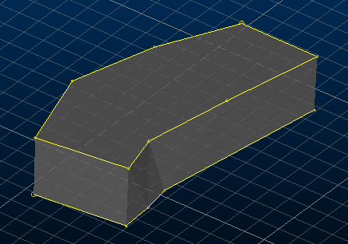

# link-outline-pair ("l2")

See this command in the [**command table**.](<COMMAND%20TABLE_L.md#link-outline-pair>)

To access this command:

  * Explicit ribbon >> Create >> Link Pair
  * Using the **[command line](<../COMMON/Command_Toolbar.md>)** , enter "link-outline-pair"

  * Use the quick key combination "l2".

  * Display the **[Find Command](<../COMMON/findcommand.md>)** screen, locate **link-outline-pair** and click **Run**.

## Command Overview

Create a wireframe from a pair of drive roof and floor strings.

This command is typically used to create a wireframe from underground survey data. This survey data be surveyed or digitised and then interpolated for the correct elevations, to create completely three-dimensional floor and roof strings for each drive. 

Once strings are picked, a drive wireframe model is created by [end-link](<end-link.md>)ing both strings and linking them to each other. If a cell model has been opened, the drive is fully evaluated against it. The newly-created wireframe joins any other currently available wireframe data.

**Note** : a variation of this command, [link-outline-pair-attribute ("l3o")](<link-outline-pair-attribute.md>), is very similar but instead uses a common attribute from at least two strings to create wireframe surface data.

### Using the 3D Solid linking method

If you have strings on adjacent sections that are to be linked together, and those strings cross each other when viewed in the direction of wireframing, then temporary vertices are inserted into the string and these temporary vertices are used when the wireframe is created. Since pairs of strings are wireframed at a time it is possible for these temporary vertices to be created for one pair of strings and not the other. In this situation a wireframe may be built which contains inconsistencies. 

Therefore, the 3D-Solid method is not suitable for use with the older linking commands if adjacent sections contain strings that cross each other in the direction of wireframing.

See [**3D Solid linking method**.](<../COMMON/3D%20Solid%20Linking%20Method.md>)

Command steps:

  1. In the Current Objects toolbar, select or create a new current wireframe object.

  2. Before running the command select at least two strings with a common attribute.

  3. Run the command.

  4. Click **OK**.

Wireframe data is generated in the current wireframe object. A closed wireframe object is created, for example:

;>)

Related topics and activities

  * [link-outline-pair-attribute ("l3o")](<link-outline-pair-attribute.md>)

  * [link-boundary ("lbo")](<link-boundary.md>)

  * [link-boundary-to-line ("lbl")](<link-boundary-to-line.md>)

  * [create-drive ("cdr")](<create-drive.md>)

  * [end-link ("eli")](<end-link.md>)

  * [end-link-boundary ("elb")](<end-link-boundary.md>)

  * [end-link-selected-strings](<end-link-selected-strings.md>)