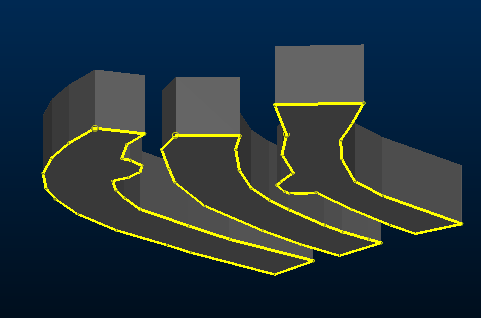

# link-selected-outlines

See this command in the [**command table**.](<COMMAND%20TABLE_L.md#link-selected-outlines>)

To access this command:

  * Using the **[command line](<../COMMON/Command_Toolbar.md>)** , enter "link-selected-outlines"

  * Display the **[Find Command](<../COMMON/findcommand.md>)** screen, locate **link-selected-outlines** and click **Run**.

## Command Overview

Create a wireframe from a drive outline string and a supplied height. 

This command requires one or more selected (closed) strings and will typically be used to create a wireframe model of underground survey data. This survey data is surveyed or digitised and then interpolated for the correct elevations, to create a completely three-dimensional floor or roof string for each drive.

**Note** : end linking for this command is enabled or disabled using the [link-selected-string-el-switch](<link-selected-string-el-switch.md>) command.

Command steps:

  1. Load the string data to be linked. These are closed strings.

  2. Select the string data to be used to generate wireframes.

  3. If you wish to store output wireframe data in a new object, create one using the **Current Objects** toolbar.

  4. Run the command.

  5. Enter an **Attribute to list**. If using the command interactively (that is, not via script), ignore this screen and click OK.

  6. Enter a **Projection distance**. This is typically the intended drive height.

     * If a **positive** height is set, the selected string data is extruded upwards. 

     * If a **negative** height is set, floor string data is created below the selected data. If a cell model has been opened, the drive is fully evaluated against it. The newly-created wireframe data will join any other currently available wireframe data.

  7. Click **OK**.

A drive wireframe model is created for each selected string, for example:

;>)

Related topics and activities

  * [link-selected-string-el-switch](<link-selected-string-el-switch.md>)

  * [link-selected-strings-attrib](<link-selected-strings-attrib.md>)

  * [link-selected-strings-plane](<link-selected-strings-plane.md>)

  * [link-selected-strings-plane](<link-selected-strings-plane.md>)

  * [link-single-outline](<link-single-outline.md>)