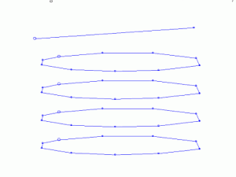
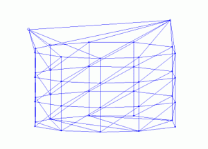

# link-to-line ("ll")  
  
See this command in the [**command table**.](<COMMAND%20TABLE_L.md#link-to-line>)

To access this command:

  * Explicit ribbon **> >**Create >> Link >> Link to Line

  * Using the **[command line](<../COMMON/Command_Toolbar.md>)** , enter "link-to-line"

  * Use the quick key combination "ll".

  * Display the **[Find Command](<../COMMON/findcommand.md>)** screen, locate **link-to-line** and click **Run**.

## Command Overview

Create a wireframe link between a perimeter (closed string) and a string.

In the example below, this command is used to link the top string with the underlying perimeter; the remaining perimeters are linked using [link-strings](<link-strings.md>), while the bottom perimeter is closed using [end-link](<end-link.md>):

The final wireframe volume:

  * To close a shape off at a line to form a wedge requires that both strings are closed. This command will duplicate all points on the line effectively closing it. This point duplication is carried out internally prior to linking.

  * An error is reported if both of the selected strings are either open or closed.

  * If the line is specified with the minimum number of points, then additional points can be generated in the link with the new point separation (dtm-new-point-separation) command to improve the triangle shape.

Command steps:

  1. In the Current Objects toolbar, select or create a new current wireframe object.

  2. Run the command.

  3. Following the prompts in the Status Bar, select a point on the first string.

  4. Select a point on the second string.

Related topics and activities

  * [close-all-strings](<close-all-strings.md>)

  * [link-strings](<link-strings.md>)

  * [end-link](<end-link.md>)