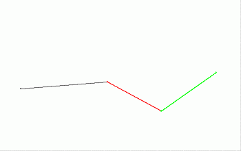
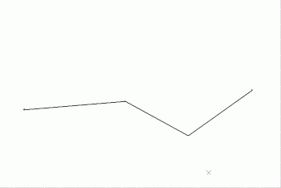

# merge-string-segments ("mrs")

See this command in the [**command table**.](<COMMAND%20TABLE_M.md#merge-string-segments>)

To access this command:

  * **Digitize** ribbon **> > Tools >> Connect >> Merge Strings**.

  * Using the **[command line](<../COMMON/Command_Toolbar.md>)** , enter "merge-string-segments"

  * Use the quick key combination "mrs".

  * Display the **[Find Command](<../COMMON/findcommand.md>)** screen, locate **merge-string-segments** and click **Run**.

## Command Overview

Merge the current strings object's selected string segments if they have coincident end points.

**Tip** : This command is especially useful for imported CAD string files; the CAD polylines are imported as individual string segments and this function will re-connect the segments into their original polyline/string state.

Only selected strings within the current string object are considered for merging. Any selected strings that are not in the current string object are ignored. A message is given if this is the case. See [The Current Object ](<../COMMON/Concept_Current_Object.md>).

String data must be selected prior to running this command. 

Edge attributes from the merged string are _not_ retained - If the strings being merged have different attribute values, the original string values are used. If attribute preservation is required, use [merge-string-segments-attrib](<merge-string-segments-attrib.md>) instead.

**Note** : This command can be undone. In addition to the original strings being restored the newly created strings are deleted.

Command Example

In the example below, a strings object, consisting of three separate segments (with shared ends) is merged into a single string.

The string object consisting of three segments before merging:

The string object after merging, now consisting of a single string consisting of three segments:

Command steps:

  1. In the Current Objects toolbar, select the strings object containing the segments to be merged, in order to make it the current strings object. 

  2. In any 3D window, select the strings (segments) to be merged.

  3. Run the command.

String segments sharing end points are linked.

Related topics and activities

  * [connect-strings ("conn")](<connect-strings.md>)

  * [connect-strings-attrib ("cona")](<connect-strings-attrib.md>)

  * [merge-string-segments-attrib](<merge-string-segments-attrib.md>)

  * [merge-strings-to-object](<merge-strings-to-object.md>)