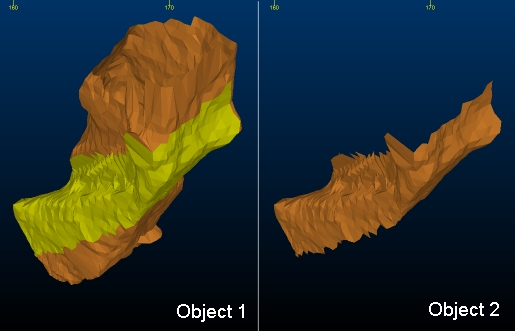

# merge-wf-to-object ("wfmto")

See this command in the [**command table**.](<COMMAND%20TABLE_M.md#merge-wf-to-object>)

To access this command:

  * **Explicit** ribbon **> > Edit >> Copy > Wireframe to Object**.

  * Using the **[command line](<../COMMON/Command_Toolbar.md>)** , enter "merge-wf-to-object".

  * Use the quick key combination "wfmto".

  * Display the **[Find Command](<../COMMON/findcommand.md>)** screen, locate **merge-wf-to-object** and click **Run**.

## Description

Copy selected wireframe data into the current strings object. The selected wireframe data can come from multiple string objects.

Command steps:

  1. In the Current Objects toolbar, either create a new wireframe object to contain the merged/copied data, assigning it as the current wireframe object, or set another wireframe object to be current.

See [The Current Object ](<../COMMON/Concept_Current_Object.md>).

  2. In any 3D window, select the wireframe data that need to be copied to the current wireframe object. See [Wireframe Selection](<../COMMON/Wireframe_Selection_Concept.md>).

  3. Run the command.

The selected data is copied to the new wireframe object, for example, below, a subset of object 1 is copied to an empty wireframe object (object 2). This results in the preselected data being copied to the new object, and can now be managed in isolation:  
  

Related topics and activities

  * [copy-wireframe](<copy-wireframe.md>)

  * [Wireframe Selection](<../COMMON/Wireframe_Selection_Concept.md>)