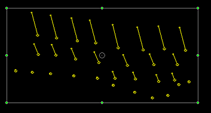
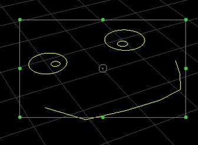
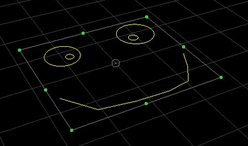

# move-strings2d ("mstr")

See this command in the [**command table**.](<COMMAND%20TABLE_M.md#move-strings2d>)

To access this command:

  * **Digitize** ribbon **> > Transform >> Transform**. 

  * Using the **[command line](<../COMMON/Command_Toolbar.md>)** , enter "move-strings2d"

  * Use the quick key combination "mstr".
  * On the **[Find Command](<../COMMON/findcommand.md>)** screen, highlight **move-strings2d** and click **Run**.

## Command Overview

Perform iInteractive rotation, scaling or moving of selected strings. 

**Important** : Strings must be selected prior to running this command.

When the command is initiated, a bounding box is generated around the selected strings. This box consists of 8 green "handles", and a point of rotation symbol in the centre, for example:

The selected strings can be using the left mouse button and dragging the grab points to a new position.

When the bounding box is shown, use the grabs to control the deformation, e.g.:  

  * Drag starting within the rotation symbol to reposition the centre-of-rotation symbol.

  * Drag starting within the box (but not the symbol) to reposition the strings.

  * Drag starting on an edge grab to scale the string(s) in the direction of the edge.

  * Drag starting on the corner grab to scale the string(s) in both axes simultaneously.

  * Drag starting outside of the bounding box to Rotate the strings around the centre-of-rotation symbol.

### Project Settings

This command is affected by your project's **[Points and Strings settings](<../COMMON/Project%20Settings_Points%20and%20Strings.md>)**. There are two possible ways that editing can be performed:

  * Data can be edited relative to the screen (that is, around a plane that is orthogonal to the current camera view). Note how the bounding box is shown as a 'flat' rectangle:

This behaviour is performed if the project setting Move relative to screen is selected.

  * Data can also be edited relative to the current _3D section plane_. This "3D" rotation allows the planar alignment of data to be maintained regardless of the position and direction of the camera. Note how the bounding box aligns with the plane of rotation/point movement:

This behaviour is performed if the project setting Move relative to plane is selected.

### Keyboard Shortcuts

You can also use keyboard modifiers to create different transformations:

  * Ctrl + Corner Scale: The same scaling is applied to both the X and Y axes.

  * Ctrl + Rotation: Rotation will occur in 15 degree increments.

### Other Options

Additional options are available via the right-mouse button to drag, which can be useful to assist with tasks such as blast vector design:

  * **Right-button drag starting on a handle** : The equivalent scaling function is performed, but only on the first point of each selected open string. This is intended to preserve the blast throw lengths of blast vectors, while allowing the point of origin pattern to be scaled.

  * **Right-button drag starting outside of the bounding box** : The equivalent rotation function is performed, but with the first point of each selected open string used as that strings centre of rotation. This is intended to preserve the blast throw origin pattern, while allowing control over blast direction.

Command steps:

  1. Select one or more strings that you wish to modify.

  2. Run the command.

  3. Modify the bounding box around the selected strings (see the introductory information, above).

  4. Click **Done** to complete the command.

Related topics and activities

  * [move-string](<move-string.md>)

  * [move-string-section](<move-string-section.md>)

  * [move-points-mode ("mpo")](<move-points-mode.md>)

  * [move-points-range](<move-point-range.md>)

  * [move-string-section](<move-string-section.md>)