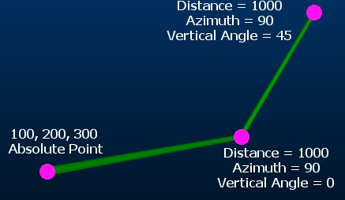

# new-traverse-string ("nts")

See this command in the [**command table**.](<COMMAND%20TABLE_N.md#new-traverse-string>)

To access this command:

  * Using the **[command line](<../COMMON/Command_Toolbar.md>)** , enter "new-traverse-string".

  * On the **[Find Command](<../COMMON/findcommand.md>)** screen, highlight **new-traverse-string** and click **Run**.

## Description

Create new points from traverse information. 

After you start the command, you will need to enter a starting point. This can either be a point that already exists or a new point can be created by entering the coordinates of the starting point and clicking **Add**. 

The next point in the traverse is created by defining a Distance and Azimuth, then either a Vertical Angle or Elevation. Once the new point has been defined and Added, it becomes the starting point for the next traverse specification.

Each time the New Traverse String screen is opened, all values are reset, although you can continue from the end of any previous string by selecting its terminal node as the Absolute Point.

Command steps:

  1. If no string data exists in your project, [create a new strings object](<../COMMON/Current_Objects_Toolbar.md>).

  2. Run the command.

  3. Select the strings object to which traverse data is added.

  4. Use the picker tool and select (snap to) a point that already exists, or click any location in the 3D window (the current active section is used to define the 3D coordinates). Alternatively, explicitly enter numeric X, Y and Z coordinates.

  5. Next, click Add. 

This sets the Absolute Point, the fully-defined position from which a traverse string will originate. The Relative Point fields are enabled once an Absolute Point is defined.

  6. Enter the required Distance of the next string segment.

  7. Set the Azimuth of the next string segment in degrees, using a range of -360 to +360.

  8. Next choose how to define the 3rd orientation parameter:

     * Vertical Angle Define the actual vertical angle at which to project the string segment, using a range of between -90 and 90 degrees (where positive values indicate "up").

     * Alternatively, define the Elevation to which the next string segment should reach before terminate. This is useful where a specific elevation is required, e.g. a known bench height.

  9. Click Add to create the next string segment. 

The end position of the string is the starting point for the next segment. 

Note: Repeated use of the Add button will continually increase the string by the defined amount and in the defined direction.

Related topics and activities

  * [new-string ("ns")](<new-string.md>)

  * [new-sketch](<new-sketch.md>)

  * [new-string-attribs-snap-switch ("asw")](<new-string-attribs-snap-switch.md>)