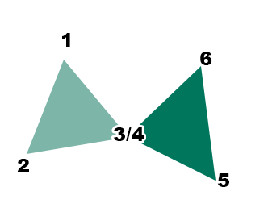
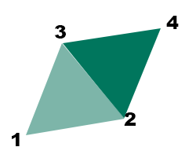

# new-triangle ("ntr")

See this command in the [**command table**.](<COMMAND%20TABLE_N.md#new-triangle>)

To access this command:

  * **Explicit** ribbon **Current Wireframe >> New Triangle**.

  * Using the **[command line](<../COMMON/Command_Toolbar.md>)** , enter "new-triangle"

  * Use the quick key combination "ntr".

  * Display the **[Find Command](<../COMMON/findcommand.md>)** screen, locate **new-triangle** and click **Run**.

## Command Overview

Defines new wireframe triangles interactively in the 3D window, either appending them to an existing or new wireframe object.

By default, the new triangles are added to the current wireframe object. If no wireframe object exists, a new object is created, displaying details of the new object immediately in the Current Object Toolbar.

The new wireframe object takes it's attributes from those of the column defaultsin the **Current Object** toolbar,. The wireframe triangles will not take attributes from loaded strings, nor will attributes be transferred when snapping to string points.

The initial triangle is formed using 3 points. Subsequent triangles are defined like this:

  * If a subsequent triangle is connected to the original by only one point, snap to the shared point and define another two points elsewhere. For example, in the image below, point (4) is snapped to the position of point (3):

  * To add a triangle that shares the edge formed by the previously-digitized two points (on the preceding triangle, just created), define a single point elsewhere. For example, in the image below, 4 points are used to create 2 triangles with a shared edge:

**Tip** : this method lets you quickly build up a set of interconnected triangles, without having to define the 3 vertices of each triangle individually.

Command steps:

  1. Run the command.

  2. In the Snapping toolbar, select the required snap mode and data selection settings.

  3. In the Current Objects toolbar, select the current object or create a new one. See [how to set the current object](<../COMMON/Current_Objects_Toolbar.md>).

  4. In the Current Objects toolbar, select the required Attribute Field and associated Attribute Value parameters. See [how to set attributes](<../COMMON/Current_Objects_Toolbar.md>).

  5. Digitize new triangle vertex positions. See the examples above for advice one whether to use 3 points or 1 point to create new data.

  6. When all triangles are created, click Done to end the command.

Related topics and activities

  * [unlink-triangle ("utr")](<unlink-triangle.md>)

  * [unlink-wireframe ("uw")](<unlink-wireframe.md>)