# offset-string ("exp")

See this command in the [**command table**.](<COMMAND%20TABLE_O.md#offset-string>)

To access this command:

  * **Digitize** ribbon **> > Tools >> Offset**.

  * Using the **[command line](<../COMMON/Command_Toolbar.md>)** , enter "offset-string"

  * Use the quick key combination "exp".

  * Display the **[Find Command](<../COMMON/findcommand.md>)** screen, locate **offset-string** and click **Run**.

## Command Overview

Creates a new string or perimeter by offsetting it on the expansion side, by a specified distance, in the plane of the current view plane.

This command can either work with preselected data or without (in which case, a string must be selected when the command is activated. See "Data Preselection" for more information.

  * If a rosettes file is loaded and use-rosettes-switch is toggled ON, the expansion distance is derived from the berm width value(s) in the **ROSBWID** field of the rosette file.

  * If a suitable block model is loaded and the [use-modelfile-switch](<use-modelfile-switch.md>) is toggled ON, the expansion distance is derived from the berm width value(s) in the **BERMWDTH** field of the block model file.

### Data Preselection

  * If no string data is selected before running the offset-string command, any string data can be offset either once or repeatedly, once an expansion distance and (if relevant) a **Corner Style** is defined; click the side of any visible string data and the string data expands either towards or away from the cursor or stylus position (depending if a positive or negative **Distance** was specified.

  * If string data is selected before running the command, only the selected string trace can be expanded, once.

### How an Offset is Applied

Strings are offset (both closed and open) by expanding or contracting the string data in a direction dictated by the view direction. As such, the view orientation is important _before_ running this command.

Consider the following example, where a simple square closed string (with all data at the same elevation) is expanded by 5m. Where the initial view directional is orthogonal to a horizontal or plan section, and this is the section upon which the string is digitized, expansion is performed outwards but remaining on the horizontal plane (image shows the original top-down view and side view after expansion):

[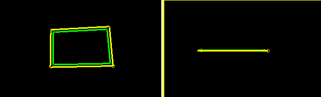](<javascript:void\(0\);>)

In the image below, the same original (green) string data is expanded by the same amount, but this time the original view direction is altered to be non-orthogonal to the horizontal plane on which the string was created:

[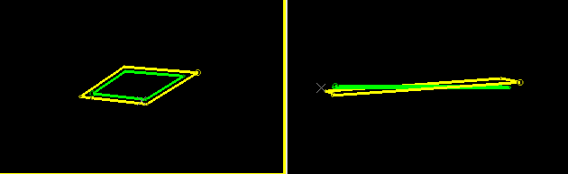](<javascript:void\(0\);>)

See how the expanded string is no longer on the horizontal plane? This is because the original string vertices were offset in a direction parallel to the view direction. Here's another look that shows this more clearly:

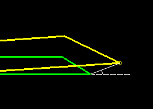

As such, when using the offset-string command, it is important to align the view beforehand so that string vertices are offset in the desired direction. One example of where this is critical is where an open decline string is offset. Typically, the view would set to plan beforehand, to ensure data is offset along the horizontal plane.

### Dealing with Overlaps Caused by Offsets

Consider the following example, where a blast boundary requires a 2m offset outwards (an expansion):

[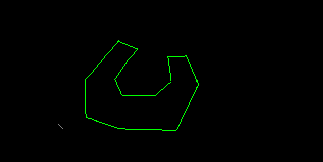](<javascript:void\(0\);>)

A single expansion is simple enough:

[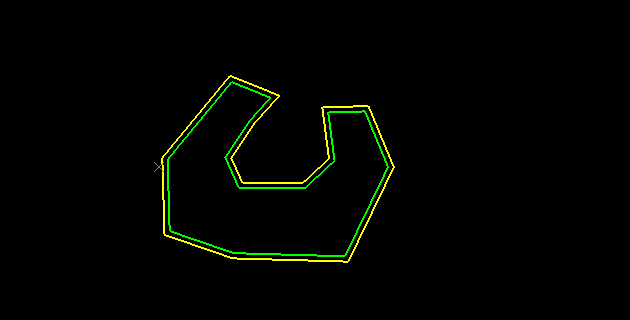](<javascript:void\(0\);>)

Expanding the original strings multiple times, however, eventually causes a potential overlap situation. Offset-string prevents overlaps, so in this case, the cutout section of the string is eventually removed to avoid self-overlapping data:

[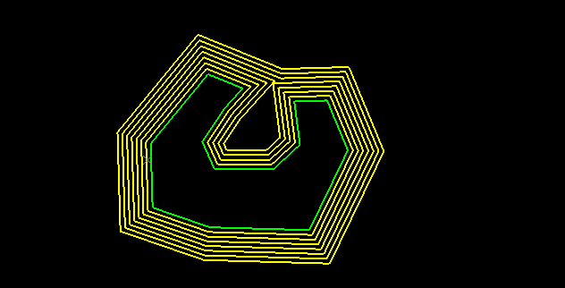](<javascript:void\(0\);>)

The above example relates to a planar string. In other situations, overlaps can occur along the line of view but may be deliberate. An example of this is a decline string. Consider the example below, where a decline string provides access to different levels. Viewed in plan, there are overlaps not present when viewed from the side. You control whether an overlap is deemed intentional or not using the **Overlap distance** field:

[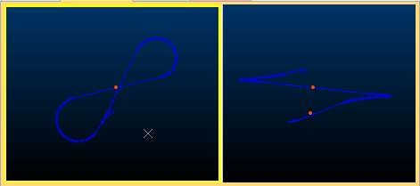](<javascript:void\(0\);>)

In the example, the red dots in the right image are 15m apart. With an **Overlap distance** tolerance of 5m, expanding the decline to one side by 3m creates an expanding segment down the entire decline:

[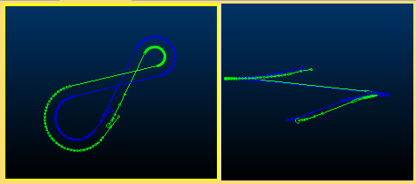](<javascript:void\(0\);>)

With an **Overlap distance** of 20m, when the overlapping point of a string falls below 20m (i.e. the string segments are less than 20m apart), the string is bridged from one segment to the other, as if the string were joined there, for example:

[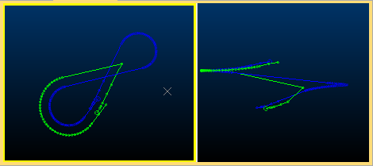](<javascript:void\(0\);>)

Command steps:

  1. Orient the view so that string expansion is performed in the desired direction. See "How an Offset is Applied", above, for more information.

  2. If you plan to expand a single string trace, select it in any **3D** view so that it is highlighted. If you plan to expand one or more string traces, one or more times repeatedly, ensure no string data is selected.

  3. Run the **offset-string** command.

  4. The **Set String Offset Parameters** screen displays.

  5. Choose the **Distance** to offset the target string.

  6. If the base string has overlaps along the line of view, determine when an overlap is deemed intentional using **Overlap distance** , where lower values tend to require more closely overlapping strings (along the line of sight) to be deemed unintentional. See "Dealing with Overlaps Caused by Offsets", above, for more guidance.

  7. If expanding an open string, choose how sharp angle changes are treated using the **Corner Style** menu:

     * _SQUARE_ Preserve offset distances as much as possible at corners by 'squaring off' if required. For example:

[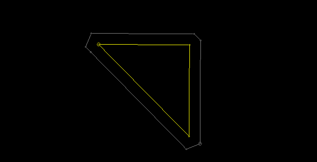](<javascript:void\(0\);>)

     * _CURVED_ Expand the string and reduce sharp angle changes in the expanded result by continuing a curve (if possible) between neighbouring string segments. For example:

[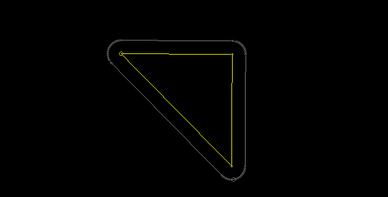](<javascript:void\(0\);>)

     * _MITRE_ Expand the string to maintain the expected expansion, maintaining angles between edges. For example:

[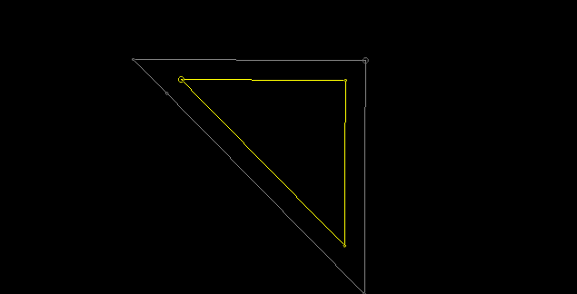](<javascript:void\(0\);>)

  8. If no string data was previously selected, select the required string or perimeter, on the expansion side. In this situation, the command remains active (as indicated by the **Done** button in the top left corner of the 3D view). Click another string trace to expand it by the set **Distance** and repeat for any number of string traces in view. 

Click **Done** to terminate the command.

If string data was already selected, it is expanded and the command completes automatically.

Related topics and activities

  * [offset-outside-string](<offset-outside-string.md>)

  * [ offset-inside-string](<offset-inside-string.md>)

  * [ project-string-at-angle](<project-string-at-angle.md>)

  * [ use-modelfile-switch](<use-modelfile-switch.md>)

  * use-rosettes-switch