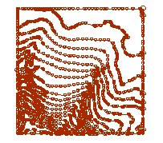
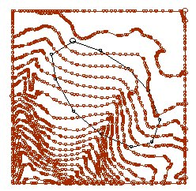
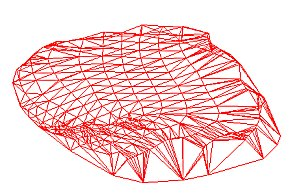

# pick-outer-limit

See this command in the [**command table**](<COMMAND%20TABLE_P.md#pick-outer-limit>).

To access this command:

  *   * Using the **[command line](<../COMMON/Command_Toolbar.md>)** , enter "pick-outer-limit"

  * Display the **[Find Command](<../COMMON/findcommand.md>)** screen, locate **pick-outer-limit** and click **Run**.

## Command Overview

Select a string that is to define an outer limit of the DTM.  

The string must be closed. When the string is selected it is displayed in the color cyan to indicate it is an outer limit string. The string can represent a two dimensional outline of the required DTM or it can contain points that are required to make up part of the DTM. If the string represents a two dimensional outline then only the X and Y coordinates of its points are considered. The dtm-limit-include-switch controls whether or not the selected limit is included when the DTM is generated.

Command Example

The tutorial database file `_vb_stopo.dm` has been used for this example.

  1. Load a set of topography strings into the 3D window. View the topography strings in a plan view:  
  

  2. Create a new strings object. You can use the [The Current Objects Toolbar](<../COMMON/Current_Objects_Toolbar.md>) to do this.

  3. Create a new string on the current wireframe object (remember to right-click to set the last point to close the string), as demonstrated by the black line in the image below:  
  

  4. In the [Command Line](<../COMMON/Command_Toolbar.md>) run _pick-outer-limit_ , then select your new string.

Note: Limit strings must be based on at least one object being selected for inclusion in DTM creation. If a limit string exists for an object that is not selected in the **Objects** list for this screen, it is ignored.

  5. Run [dtm-create](<dtm-create.md>) and ensure that the appended wireframe object is selected, and change the **Name** to 'TrimmedDTM'

  6. Finally, select a colour for your new terrain model, and click OK.

  7. The object 'TrimmedDTM' is created in memory. Use the [Sheets](<../COMMON/Sheets%20Control%20Bar%20Overview.md>) control bar to switch off the view of all other objects:  
  

Note: In this example, the edges of the trimmed section are 'cupped'. This is because the original limit string was designed on the viewplane and not directly onto the topographical surface.

Related topics and activities

  * [pick-inner-limit](<pick-inner-limit.md>)