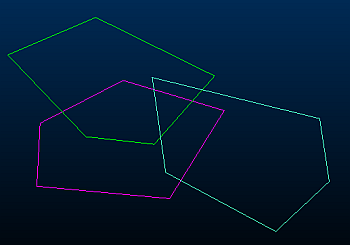
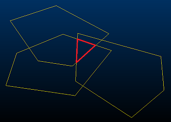

# polygon-intersection ("plyi")

See this command in the [**command table**.](<COMMAND%20TABLE_P.md#polygon-intersection>)

To access this command:

  * **Digitize** ribbon >> **Tools >> Combine >> Intersect Polygons**.

  * Using the **[command line](<../COMMON/Command_Toolbar.md>)** , enter "polygon-intersection".

  * Use the quick key combination "plyi".

  * Display the **[Find Command](<../COMMON/findcommand.md>)** screen, locate **polygon-intersection** and click **Run**.

## Command Overview

For selected polygons in any 3D window, this command creates a new polygon which contains the area common to all of them.

**Note** : A variation of this command - [polygon-intersection-delete-originals](<polygon-intersection-delete-originals.md>) \- erases the original polygon data before creating the intersection area.

Command steps:

  1. Create overlapping polygons using either the [new-polygon](<new-polygon.md>) or [new-string](<new-string.md>) command, for example:

  2. Select all overlapping polygons and run the polygon-intersectioncommand. 

A new polygon is created that contains the area common to all overlapping polygons, for example:  
  

Related topics and activities

  * [polygon-intersection-delete-originals](<polygon-intersection-delete-originals.md>)

  * [new-polygon](<new-polygon.md>)

  * [polygon-union](<polygon-union.md>)