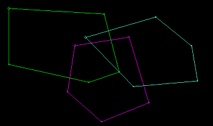
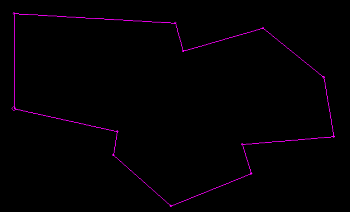

# polygon-union ("plyu")

See this command in the [**command table**.](<COMMAND%20TABLE_P.md#polygon-union>)

To access this command:

  * **Digitize** ribbon >> **Tools >> Combine >> Polygon Union**.

  * Using the **[command line](<../COMMON/Command_Toolbar.md>)** , enter "polygon-union".

  * Use the quick key combination "plyu".

  * Display the **[Find Command](<../COMMON/findcommand.md>)** screen, locate **polygon-union** and click **Run**.

## Command Overview

Create a unified perimeter based on other loaded closed strings. How this command operates depends on the relative arrangement of the target strings:

  * If overlapping polygons are selected in the 3D window, this command creates a new polygon which contains the area inside all of them.
  * If separate polygons are selected in the 3D window, this command creates an identical polygon for each selected item.

**Note** : A variation of this command - **[polygon-union-delete-originals](<polygon-union-delete-originals.md>)** \- erases the original polygon data before creating the shared area polygon.

Command steps:

  1. Create overlapping polygons using either the [new-polygon](<new-polygon.md>) or [new-string](<new-string.md>) command, for example

  2. Select all overlapping polygons, and run the command.

  3. A new polygon is created that contains the area inside all overlapping polygons:  
  

Related topics and activities

  * [polygon-union-delete-originals](<polygon-union-delete-originals.md>)

  * [new-polygon](<new-polygon.md>)

  * [polygon-intersection](<polygon-intersection.md>)