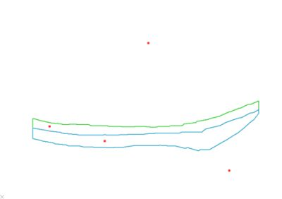
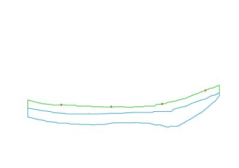

# project-points-to-wf ("ptp")

See this command in the [**command table**](<COMMAND%20TABLE_P.md#project-points-to-wf>).

To access this command:

  * **Digitize** ribbon **> > Project >> Points to Wireframes**.

  * Using the **[command line](<../COMMON/Command_Toolbar.md>)** , enter "project-points-to-wfs"

  * Use the quick key combination "pptw".

  * Display the **[Find Command](<../COMMON/findcommand.md>)** screen, locate **project-points-to-wfs** and click **Run**.

## Command Overview

Project selected point(s) vertically onto the uppermost surface of the current wireframe object.

The points are projected vertically, regardless of:

  * the current view direction and;

  * whether or not the wireframe is displayed in the view. Wireframe overlay objects that are loaded but hidden are also used when points are projected.

This example below shows the position of selected points before (left) and after (right) projection:

;>) Points before projection |  ;>) Points after projection  
---|---  
  
Command steps:

  1. Select the current wireframe object. See [The Current Object ](<../COMMON/Concept_Current_Object.md>).

  2. Select point data to project.

  3. Run the command.

Point data is projected vertically to the uppermost wireframe surface.

Related topics and activities

  * [Project Strings & Points](<../COMMON/ProjectStringsPoints_Dialog.md>)

  * [project-to-view-plane ("ptv")](<project-to-view-plane.md>)
  * project-points-to-wireframe

  * [project-points-to-wf-in-view](<project-points-to-wf-angle.md>)

  * [project-points-to-wf-angle](<project-points-to-wf-angle.md>)

  * [project-points-to-wfs ("pptw")](<project-points-to-wfs.md>)

  * [project-string-at-angle](<project-string-at-angle.md>)

  * [project-string-onto-wf](<project-string-onto-wf.md>)

  * [project-string-onto-wf-limit](<project-string-onto-wf-limit.md>)

  * [move-string-to-view ("mtv")](<move-string-to-view.md>)