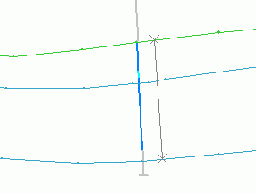
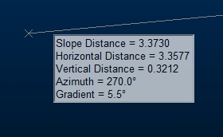

# query-lines ("ql")

See this command in the [**command table**.](<COMMAND%20TABLE_Q.md#query-lines>)

To access this command:

  * Home ribbon >> Query >> Line

  * Using the **[command line](<../COMMON/Command_Toolbar.md>)** , enter "query-lines"

  * Use the quick key combination "ql".
  * On the **[Find Command](<../COMMON/findcommand.md>)** screen, highlight **query-lines** and click **Run**.

## Command Overview

Calculate statistics for a line interactively defined by two end points.

This command honours current data selection and snap settings. Points that are selected using left-click (no snapping) in any **3D** window, are placed on the current section plane.

As an example, querying the line, snapped to the two strings shown below (ore body section strings and drillhole data) :  
  

If cursor tooltips are enabled, summary information is displayed on screen at the cursor location, after the first point has been digitized:

You can click and hold/drag the second point to dynamically update cursor tooltip information as the cursor moves. 

  * If the line is horizontal \- only horizontal distance is shown (plus azimuth and gradient).

  * If the line is vertical - only vertical distance is shown (plus azimuth and gradient).

  * Otherwise slope, horizontal and vertical distance are shown.

Command steps:

  1. Run the command.

  2. Select (left or right-click) the line's first point.

  3. Select (left or right-click) the lines second point.

  4. Check the position of the grey query line and the associated statistics in the Output control bar.

Displayed statistics include:

     * X, Y and Z coordinates of each of the end-points

     * X, Y and Z Difference between the second and first points

     * Slope Distance, Horizontal Distance and/or Vertical Distance between the two points

     * Azimuth (direction) of the line in degrees

     * Gradient of the line in degrees, 1:X and %.

Related topics and activities

  * [query-angle ("qa")](<query-angle.md>)

  * [query-current-file-filters ("qf")](<query-current-file-filters.md>)

  * [query-multiple-drillholes ("qmd")](<query-multiple-drillholes.md>)

  * [query-multiple-strings ("qms")](<query-multiple-strings.md>)

  * [query-points ("qp")](<query-points.md>)

  * [query-single-point ("qsp")](<query-single-point.md>)

  * query-lines ("ql")

  * [query-string-between-points ("qsb")](<query-string-between-points.md>)

  * [query-triangle ("qt")](<query-triangle.md>)