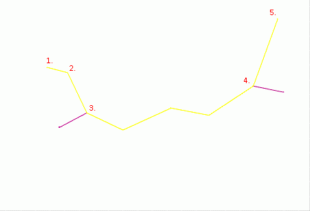

# rapid-digitize-switch ("rap")

See this command in the [**command table**.](<COMMAND%20TABLE_R.md#rapid-digitize-switch>)

To access this command:

  * **Home** ribbon **> > Edit Modes >> Rapid Digitize**.

  * **Digitize** ribbon **> > Edit Modes >> Rapid Digitize Mode**.

  * Using the **[command line](<../COMMON/Command_Toolbar.md>)** , enter "rapid-digitize-switch"

  * Use the quick key combination "rap".
  * On the **[Find Command](<../COMMON/findcommand.md>)** screen, highlight **rapid-digitize-switch** and click **Run**.

## Command Overview

Toggles the capability to incorporate segments of an existing string(s) when digitizing a new string using [new-string](<new-string.md>) or extending an existing string using [extend-string](<extend-string.md>). All segments of an existing string, between the two snapped reference points, are duplicated and used as part of the new string.

  * If the reference string snapped to is closed, the command will always choose the shortest distance between the snap points.

  * The snap settings will determine the snapping behavior. 

  * The new string may be extended along the length of the existing string by repeatedly snapping using the right mouse button. If an error is made, the [undo-last-string-edit](<undo-last-string-edit.md>) command will remove the erroneous section.

### Command Example

Using the following string as a reference...

...the following new string (highlighted yellow) can be created by digitizing the five points shown in sequence, snapping to points 3 and 4:

   

Command steps:

This command is typically accessed whilst digitizing new string(s), with other strings displayed on screen:

  1. Running the rapid-digitize-switch command.

  2. Snap (right-click) to the first reference point on the existing string.

  3. Snap to the second reference point on the same string.

  4. Rerun the command to turn the switch OFF.

  5. Digitize the remaining new string points, repeating steps 1 to 4 if required.

Related topics and activities

  * [new-string](<new-string.md>)

  * [extend-string](<extend-string.md>)

  * [new-traverse-string](<new-traverse-string.md>)

  * [undo-last-edit (<CTRL>+Z)](<undo-last-edit.md>)

  * **[undo-last-string-edit](<undo-last-string-edit.md>)**